# UX Design Specification Flow OS

**Author:** Team Mantis
**Date:** 2026-04-19

---

<!-- UX design content will be appended sequentially through collaborative workflow steps -->

## Executive Summary

### Project Vision

Flow OS is an AI-native business operating system that replaces a virtual assistant's entire tool stack (5-8 apps) with a single workspace where 6 specialized AI agents handle both frontline work (Inbox, Calendar) and back-office operations (AR Collection, Weekly Report, Client Health, Time Integrity). The core product thesis is not consolidation — it is **trust**: VAs will progressively delegate client-facing actions to AI agents after experiencing clean proposals in their first two weeks. If trust builds, Flow OS becomes indispensable. If trust fails, the product degrades to just another SaaS tool.

The UX challenge is not making a pretty interface. It is **designing the emotional arc of trust** — from skepticism through curiosity, first win, growing confidence, to "I can't imagine going back." Every screen, interaction, and agent behavior must serve that arc.

### Target Users

**Primary — Solo VA (Maya)**
3-10 clients, $25-75/hr, currently juggling 5-8 tools. Starts the day scanning Gmail anxiously. Wants efficiency but fears losing control of client relationships. Her quiet question: "Is this replacing me?" She needs to feel like the conductor of an AI orchestra, not a spectator at her own concert. She lives in her keyboard. She has 12 minutes before her first client call.

**Secondary — Agency Owner (David)**
2-10 team members, 15-40 clients. Needs oversight, not just execution. Sees Flow OS as a dashboard of trust — which VAs use agents well, which agents perform, where bottlenecks are. Fundamentally different cognitive load from the solo VA. May never touch the timer or agent inbox directly.

**Tertiary — Team Member (Elena)**
Junior VA with scoped access to specific clients. Needs guided workflows, progressive permissions, and a learning path. Must not see data from clients she doesn't serve.

**External — End Client (Sarah)**
SME owner receiving VA services. Accesses via magic-link portal. Doesn't care about Flow OS — cares about her invoice and her deadline. The portal must make the VA look phenomenal. It is the VA's trophy case, not a data window. It is also Flow OS's primary distribution channel via subtle "Powered by Flow OS" attribution.

### Key Design Challenges

**1. Trust as a UX Problem**
Trust progression (Supervised → Confirm → Auto) is the primary innovation and the biggest UX risk. The "5+ clean proposals builds trust" assumption is unvalidated. The trust rupture point is not at proposal #5 — it is wherever the first imperfection hits. The UX must frame agent mistakes as learning moments, not failures. Transition states between trust levels need the same design rigor as core flows. Can a VA bump an agent back to Confirm *just for this week*? These "between states" are where trust crystallizes or shatters.

**2. The Cold Start Problem**
Approximately 90 seconds to convert skepticism into belief. Agents in Supervised mode are clumsy. The first agent mistake must not be framed as a failure — it must feel like a new hire asking a question. A designed "miracle moment" within the first 3 minutes is essential — something that makes the VA physically lean forward.

**3. Three Mental Models, One Product**
Solo VA, Agency Owner, and End Client have fundamentally different reasons for being there. One information architecture cannot serve all three with equal weight. The client portal must feel like a different product that shares data, not a restricted version of the main workspace. The Agency Owner sees a dashboard; the Solo VA sees a daily workspace; the client sees a trophy case.

**4. Agent-Human Collaboration UX (Novel Territory)**
The interaction pattern for agent collaboration doesn't exist in productivity tools. It should feel like a post-it note from a colleague — brief, contextual, action-oriented. Not a conversation. A handoff. The agent inbox is the architecturally riskiest surface (stale proposals, burst flooding, race conditions) and also the most important UX surface. Design for degradation: every real-time feature needs a "stale data" state, every agent interaction needs a "taking longer than expected" state.

**5. Portal as Viral Engine**
Read-only doesn't viral. The client portal needs client *actions* — approving, requesting, commenting — to drive distribution. Every pixel reflects on the VA's professionalism. One janky portal = dead distribution channel.

**6. The VA's Unspoken Fear**
Flow OS automates chunks of a VA's livelihood. The language, framing, and visual tone must consistently say "we amplify you, we don't erase you." The VA's name should always be bigger than the agent's name. Agents should feel like a team the VA manages, not efficiency that makes them smaller.

### Design Opportunities

**1. Morning Brief as Habit Anchor**
The Inbox Agent's daily digest must become the reason a VA opens Flow OS before Gmail by day 14. This requires the Brief to be decisive, not informational: "3 things need your attention, and here's what I already handled." The dopamine hit of "already handled" is what builds the habit.

**2. Time Integrity Agent as Trojan Horse**
Every VA hates tracking time. An invisible time tracker that captures billable hours without the VA doing anything — that is the 30-second demo. Found money. The experience that gets a VA to add their second client, their third, and hit the Free tier wall.

**3. Progressive Disclosure as Trust Metaphor**
The UI mirrors trust progression: new users see more controls, more confirmations, more "why" explanations. As trust builds, the UI becomes calmer, showing less chrome and more outcomes. "Calm" must not cross into "dead" — agents doing work should have subtle ambient vitality, like walking into a well-run kitchen.

**4. Agent Personality as Trust Architecture**
Agents need reliable behavioral signatures. The Calendar Agent should feel different from the AR Agent, in ways matching their function. Consistency builds trust faster than cleverness.

**5. Trust Score as Living Indicator**
A visible, celebratory trust indicator — not a punitive grade, but a signal that says "you and your agents are in sync." Make it feel like a band that's really clicking.

**6. Designed First 30 Days**
The emotional arc — skepticism → curiosity → first win → growing confidence → "I can't imagine going back" — must be as intentionally designed as any wireframe. Each week should have a designed milestone moment.

### Technical UX Constraints

- **Supabase RLS + junction tables** means complex queries for Team Members. Favor paginated/filtered views over "show everything" dashboards. Pre-computed summary cards over real-time aggregation.
- **Agent inbox is a materialized view of distributed state** — design for stale proposals (dim them), burst states (collapsed summaries), and delayed status updates.
- **Timer must survive auth refresh** — server-side concept, not React state. Auth token refresh must be invisible to timer component.
- **Phase 1 proposals are async loops**, not real-time collaboration. Design for "propose → review → accept/revise" patterns, not simultaneous editing.
- **Cmd+K palette limited to 15-20 actions** — every command maps to a server action. Keep focused.
- **240px sidebar enforces flat navigation** — embrace this constraint, don't fight it with fly-out menus.
- **Client portal is architecturally its own product** — design it independently, not as a restricted workspace.

## Core User Experience

### Defining Experience

The core feeling Flow OS must deliver is not "efficient task management" — it is **the feeling of being someone who never drops a ball**. The VA wakes up afraid she forgot something, exhausted by the mental load of holding a client's world in her head. Flow OS replaces that dread with reassurance.

The Agent Inbox is the *container* for this experience, not the experience itself. The true core loop is:

**Feel anxious → Get reassurance → Look brilliant → Feel confident → Trust deepens → Come back tomorrow**

The inbox, timer, and portal are *entry points* into this loop at different moments of the day, measured by anxiety resolution, not frequency.

**The Agent Inbox Loop** (1-3x daily, 5 min clear) is the primary daily interaction — where trust is built or broken. It should function as a cockpit instrument panel, not a message queue: most of the display is "all quiet" (absence of signal = safety), with attention drawn only to deviation from normal.

**The Timer** (10x/day) is the highest-frequency utility — a continuous thread feeding the system. Each start/stop is low-stakes reassurance.

**The Client Portal** is the VA's *performative surface* — the reason the inbox matters. The VA cares about what the client will see. The portal makes her look proactive, organized, indispensable. The inbox is backstage; the portal is the show.

**Dual Core Loop:** The solo VA loop (Scan → Understand → Decide → Trust Grows) differs from the agency owner loop (Assign → Monitor Exceptions → Intervene). Build the solo VA experience as default; layer agency features in via progressive disclosure for *role*, not just complexity.

### Platform Strategy

| Platform | Scope | Priority |
|----------|-------|----------|
| Desktop web (Next.js) | Full experience — editing, invoicing, agent management, settings | Primary |
| Mobile web | Core flows — timer, inbox review, portal approval, notifications, glanceable status | Secondary |
| Native mobile | Deferred to v2.0 (React Native roadmap) | Future |

- Keyboard-first input. Cmd+K palette as primary navigation (limited to 15-20 high-value actions).
- Every frequent action has a discoverable shortcut. Progressive disclosure for shortcuts.
- Mobile web must support the "3-second glance" — status at a glance between meetings.
- No offline in v1 (deferred to v1.5 PWA). Timer survives auth refresh via server-side persistence.

### Effortless Interactions

**Target-zero-friction:**
1. Starting the timer — Cmd+Shift+T, one click on recent project. 2 seconds.
2. Approving an agent proposal — one click "Looks good" from inbox. No modal. 1 second.
3. Batch-approving weekly reports — select all → "Approve all." 5 items in 10 seconds.
4. Magic-link portal access — click email link → authenticated → see action item. Zero cognitive load.
5. Retroactive time entry — Cmd+Shift+E, project pre-filled from calendar context. 15 seconds.

**Zero user action (automatic):**
- Client Health scoring (every 4 hours, background)
- Time Integrity gap detection (daily sweep, surfaces as inbox item)
- AR follow-up scheduling (post-send, auto-schedules next touch)
- Trust level progression (behind the scenes, surfaced as celebration)
- Empty inbox reassurance ("All clear — your agents handled everything overnight")

**Critical nuance:** "Effortless" for a mature user (Day 30) differs from "effortless" for a new user (Day 3). Day 3 behavior is reading everything carefully to build a mental model — that is not friction, it IS the trust-building process. Design for both stages. Do not optimize away the learning phase.

### Critical Success Moments

**The Emotional Arc of Week 1 (narrative, not checklist):**

- **Day 1 — Wonder:** First Morning Brief must demonstrate "I understand your business" — not "I'm powerful AI." One thing that makes the VA physically lean forward. The agent picked up context from onboarding, surfaced the right priorities, used matching language.
- **Day 1-3 — First proposal approval:** The VA clicks "Looks good" and the email sends. Agent becomes real. Draft quality determines whether trust starts building or stalling. This is also where the VA builds her mental model of what "good" looks like — slow, careful reading is healthy, not friction.
- **Day 4-5 — First friction:** Something the agent got wrong, or the VA second-guessing herself. This is more important than getting everything right. If the system gracefully handles the first mistake — shows why, offers a fix, feels like a competent teammate having an off moment — trust deepens more than if nothing went wrong.
- **Day 6-7 — The choice:** Trust or micromanage. The Morning Brief evolves its framing: Day 1 "Here's everything I can do," Day 3 "Here's what I handled, just confirming," Day 7 "Handled. You're welcome." Same feature, different emotional pitch.
- **Day 8-14 — Invisible competence emerges:** The first invoice generation (40 minutes saved). The first client portal interaction (portal becomes real). The first batch approval (5 items in 10 seconds). The feeling shifts from "impressive tool" to "I can't imagine going back."
- **Day 15 — Graduation ritual:** Trust progression completion must not feel like being fired by your own software. Design a celebration moment, not a disappearance.

**If failed, ruins the experience:**
- Agent sends an embarrassing email to a client (trust rupture, potential churn)
- Timer loses data during auth refresh (utility failure, confidence loss)
- Portal looks unprofessional to a client (VA's reputation damaged)
- Empty inbox on Day 1-3 with no explanation (disappointment conditioning)

**Make-or-break insight:** The system hides its successes and amplifies its failures (Negativity Asymmetry). Invisible competence goes unnoticed; one bad proposal is vivid. Trust drops 10x faster than it builds — need ~7:1 positive-to-negative ratio, not the assumed 5 clean proposals.

### Experience Principles

1. **Agents are teammates, not tools.** The VA is always the conductor. Agents have behavioral signatures, not just names. When an agent fails, the experience feels like a competent teammate having an off moment — not a robot malfunctioning. The recovery UX is where this metaphor lives or dies.

2. **Calm competence over dazzling AI.** The UI feels like a well-run kitchen — ambient vitality, not notification noise. Outcomes over process. No "AI-powered" badges. The best employee anticipates needs, communicates clearly, never shows off.

3. **Trust is visible, reversible, and per-agent.** Every agent action shows who did it, why, and offers one-click undo. Trust progression is tracked per-agent independently, celebrated (not just tracked). Agent actions carry a *confidence signal* — body language, not percentages: "I'm sure about this" / "You should double-check" / "I'm guessing here, please review."

4. **Keyboard as first language.** Every frequent action has a shortcut. Cmd+K is the front door. VAs are fast typists; the product matches their speed. Flow state within a week — muscle memory like mastering Gmail shortcuts.

5. **Progressive disclosure mirrors progressive trust AND role.** New users see more controls and explanations. Power users see outcomes. The UI evolves with the relationship. Agency features layer in for agency owners. But never hide what the VA might need right now — focused is not dumbed down.

6. **Design for degradation.** Every real-time surface has a stale-data state. Every agent action has a "taking longer" state. Reliable feels better than fast-then-broken. This is not pessimism — it is what makes the product feel trustworthy.

7. **Design for the glance.** The VA checks Flow OS between meetings, at a red light, during a call. Can she glance at her phone and know "everything is fine" or "one thing needs attention"? If we cannot communicate status in 3 seconds, we have failed. 80% of daily experience should be *nothing happening*, and that nothing should feel like safety.

8. **The VA narrates to her client.** Every agent action must be explainable in one sentence the VA can say to her client: "My system flagged that invoice and double-checked the due date." The VA must never be in a position where "the AI handled it" is her only explanation — that makes her look replaceable. Visibility serves narration, not just auditing.

9. **Empty inbox is delight, not disappointment.** When there's nothing to review, that is a trust-building moment — "Your agents handled everything overnight. All quiet." Design the empty state as reassurance, not a dead session.

10. **Invisible competence made visible weekly.** Weekly "Here's what your agents handled while you slept" summaries. The VA sees accumulated value, not just individual actions. This counters the negativity asymmetry and makes the case for trust progression.

## Desired Emotional Response

### Primary Emotional Goals

**Primary: Relief that opens into Pride.**

Relief is the floor — the daily exhale, the inbox that says "handled." But relief is transient and private. It doesn't drive upgrades, sharing, or identity attachment.

Pride is the ceiling — earned, self-reinforcing, performative. A VA who looks at her branded portal and thinks "this is MY business, this is MY system" doesn't churn. She shares screenshots. She tells her VA friends. She upgrades for more.

The deeper emotional truth beneath both is **Vindication**: "I was right about myself. I am excellent. Here is the evidence." Flow OS doesn't relieve the VA — it vindicates her. The agent that drafts something exactly as she would have, without being told, says: "Your instincts are real. Your judgment is legible."

**Secondary emotions:**
- **Confidence** — "I can explain this to my client" (not "the AI handled it")
- **Agency** — "I'm the conductor" (not "I'm being managed by software")
- **Meaning** — "I'm not just efficient — I'm essential"
- **Professional pride** — "My clients see me as organized and proactive" (via the portal)
- **Progress** — "My agents are getting better" (trust accumulation made visible)
- **Identity continuity** — "I still recognize myself in this version of me"

**Emotions to avoid:**
- Obsolescence anxiety ("Am I still needed?")
- Grief for lost identity ("I used to be the one who caught everything")
- Helplessness ("I don't understand what the agent did")
- Vulnerability ("The portal makes me look replaceable")
- Shame for needing help ("I should be able to do this myself")

### Emotional Journey Mapping

**The VA's Journey (Four-Act Story):**

**Act One: The Unreliable Narrator (Day 1-3)**

| Stage | Target Emotion | Emotion to Avoid | Design Beat |
|-------|---------------|-----------------|-------------|
| First Morning Brief | Wonder + cautious recognition | Overwhelm, generic AI impression | Agent shows it *listened* — picked up onboarding context, surfaced right priorities, used the VA's language |
| First proposal | Cautious optimism + learning | Anxiety ("Is this right? I can't tell") | Slow, careful reading is healthy — not friction. Honor the skepticism. |
| First near-miss | Respect ("It caught itself") | Blind trust or blind panic | Show what agents *almost* got wrong and self-corrected. Skepticism dies when the system catches its own errors without drama. |

**Act Two: The Uncomfortable Gift (Day 4-14)**

| Stage | Target Emotion | Emotion to Avoid | Design Beat |
|-------|---------------|-----------------|-------------|
| First agent success that mirrors VA's judgment | Being seen ("It did it the way *I* would") | Guilt/grief ("If the machine can do this, what am I for?") | The First Mirror Moment: "This looked like something you'd handle a certain way, so I did." Reflect her judgment, don't replace it. |
| First mistake + recovery | Deeper trust through radical transparency | Betrayal ("It got it wrong AND embarrassed me") | Betrayal recovery: "Here is exactly where my reasoning diverged from yours. Here is what I learned about your judgment." Betrayal + learning = deeper trust than pre-betrayal. |
| First "letting go" | Small grieving of control-freak self + birth of trust | Vulnerability ("I should have checked") | The Anti-Hover Moment: Flow OS notices the VA didn't check and whispers: "You didn't check. And it was fine." |
| First invoice | Accomplishment ("I just saved 40 minutes") | Tedium ("Still feels like admin work") | Visual reward — time-auto-populated line items, professional PDF preview |
| First Friday Feeling | Bodily relief + rhythm | Dread about Monday | Friday 4pm ritual: "Here's what you accomplished. Now go live your life." Weekly rhythm, not just events. |

**Act Three: The Quiet Battle (Day 15-30)**

| Stage | Target Emotion | Emotion to Avoid | Design Beat |
|-------|---------------|-----------------|-------------|
| First batch approval | Competence + flow | Tedium | 5 items in 10 seconds. The feeling shifts from "impressive tool" to "I can't imagine going back." |
| Portal goes live to first client | Pride ("My client sees a professional") | Hypervigilance ("What if it looks bad? Is she questioning my value?") | Portal as shield — the VA's love letter to her own relevance. Every "Here's what I caught this week" is relationship maintenance. |
| Graduation to Auto | Freedom + achievement, NOT obsolescence | "Being fired by my own software" | Graduation ritual — celebration, not disappearance. Agents shift language: "I handled this the way you would. Here's why." Apprenticeship, not automation. |
| First client appreciation via portal | Vindication ("The system makes me *visible*") | Dependence anxiety ("If the system is this good, do they need me?") | The Narrative Moment — the VA realizes the system isn't making her efficient, it's making her visible. |

**Act Four: The New Story (Day 30+)**

| Stage | Target Emotion | Emotion to Avoid | Design Beat |
|-------|---------------|-----------------|-------------|
| Routine Auto mode | Freedom + confidence | Loneliness / unexpected silence | The Void Moment — weekly visualization of everything agents handled. Fill the silence with evidence of impact. |
| Week 6+ | Identity attachment ("This is MY system") | Complacency / churn risk | The Origin Story — "This is your 5th client. Remember the first one?" Flow OS becomes the witness to the VA's journey. |
| Advocacy | Pride + belonging | Private satisfaction (doesn't share) | The Advocacy Threshold — at Day 18, the share prompt arrives with genuine evidence, not empty enthusiasm. |

**The Client's Journey (currently unmapped — critical gap):**

| Stage | Client Emotion | Risk |
|-------|---------------|------|
| First portal access | Skepticism ("My VA uses AI? Is she still doing the work?") | Client questions VA's value |
| First smooth interaction | Wonder ("Things are... smoother?") | Client attributes improvement to tool, not VA |
| First proactive catch | Dependence ("She caught that thing I forgot about") | Client wonders if they need the VA or just the system |
| Steady state | Loyalty renegotiation — VA + system is better than either alone | Client tries to replicate without VA |

**Design implication:** The portal must anchor the VA's indispensability in the client's perception. Every "Here's what I caught this week" is a relationship maintenance act. The portal is not a dashboard — it's the VA's evidence of relevance.

### Micro-Emotions

| Target Micro-Emotion | Enemy | Where It Matters Most | Design Mechanism |
|---------------------|-------|----------------------|-----------------|
| **Confidence** | Confusion | Inbox proposals — VA must feel able to evaluate quality | Agent confidence signals ("I'm sure" / "Double-check" / "I'm guessing"). Enough context to narrate to client. |
| **Trust** | Skepticism | First 5 proposals — trust rupture point | Per-agent trust tracking. Mirror moments. Near-miss displays. Betrayal recovery architecture. |
| **Relief** | Anxiety | Morning Brief — the daily exhale | "Already handled" before "needs attention." Empty state = reassurance. |
| **Agency** | Helplessness | Every trust-level transition | Explicit VA choice. "Just this week" bump-backs. VA's name bigger than agent's. |
| **Professional pride** | Vulnerability | Client portal — VA's reputation on display | Trophy-case portal. Branding controls. Narratable actions. |
| **Accomplishment** | Frustration | Invoice generation — the "saved time" moment | Visual reward. Weekly value summaries. Celebrated milestones. |
| **Belonging** | Isolation | Solo VA experience — agents as teammates | Named agents. Warm tone. "Your agents" language. Origin story moments. |
| **Identity continuity** | Grief for lost self | Day 5-7 — "If the machine can do this, what am I for?" | Agents reflect judgment back. "Your way" language. Evidence of VA's expanded capacity. |
| **Being seen** | Invisibility | Weekly rhythms — the VA as protagonist, not operator | Imposter Syndrome Interceptor — evidence-based whispers. Mirror moments. Origin stories. |

### Design Implications

**Relief → Pride pipeline:**
- Morning Brief shows "already handled" before "needs attention" (relief)
- Weekly summary shows accumulated value with VA's name prominent (pride)
- Portal makes the VA look brilliant to clients (earned pride — shareable, performative)
- Friday 4pm ritual: "Here's what you accomplished. Now go live your life." (rhythmic relief → weekly pride)

**Confidence architecture:**
- Agent proposals include confidence signals — body language, not percentages
- The VA always has enough context to explain the action in one sentence to her client
- Imposter Syndrome Interceptor — evidence-based whispers: "Your response time was 40% faster than industry average"

**Agency preservation:**
- Every trust-level transition requires the VA's explicit choice with ceremony
- Trust never auto-advances silently
- "Just this week" bump-backs for difficult clients
- VA's name always bigger than agent's name
- Language: "I handled this the way you would" (apprenticeship) not "I automated this" (replacement)

**Professional pride surface (portal):**
- Portal is designed as the VA's trophy case, not a dashboard
- Branding controls, custom domain, professional PDFs
- Subtle "Powered by Flow OS" — makes the VA look good, not Flow OS
- Every "Here's what I caught this week" anchors VA's indispensability

**Identity continuity design:**
- Agents reflect VA's judgment back: "Your way" language
- The First Mirror Moment is flagged and celebrated
- Day 5-7 guilt is acknowledged, not rushed past
- Graduation feels like expansion, not obsolescence — "You're being promoted from task executor to business operator"

### Emotional Design Principles

1. **Design the exhale, not the click.** The primary interaction is relief — "handled, you're welcome." Every screen should feel like exhaling, not processing.

2. **Make invisible competence visible weekly.** The system hides its successes (Negativity Asymmetry). Counter this with weekly summaries, Void Moments, and evidence-based whispers that accumulate into confidence.

3. **Trust drops 10x faster than it builds — protect it.** Need ~7:1 positive-to-negative ratio, not 5 clean proposals. Betrayal recovery is more important than perfection. Design the "here's where my reasoning diverged from yours" moment with radical transparency.

4. **The VA narrates to her client — design for that sentence.** Every agent action must be explainable in one sentence that makes the VA look brilliant. "My system flagged that invoice" not "the AI handled it."

5. **Graduation is a celebration, not a disappearance.** Trust progression completion must feel like being promoted, not being fired by your software. Agents shift from "Is this correct?" to "I handled this the way you would."

6. **Relief opens into pride — pride drives growth.** Relief retains. Pride upgrades. Pride shares. The emotional ladder is: relief → confidence → pride → advocacy. Design each rung.

7. **The portal is a love letter the VA writes to her own relevance.** Every pixel of the client portal serves the VA's professional identity. It is her shield against client skepticism, her evidence of indispensability.

8. **Design rituals, not just features.** The Friday Feeling. The Morning Brief rhythm. The Anti-Hover whisper. The Origin Story reflection. Competitors can copy features; they cannot copy rituals embedded in emotional rhythms.

9. **Hold space for grief — don't rush past it.** The Day 5-7 identity crisis ("If the machine can do this, what am I for?") is real and healthy. Design for it: acknowledge, reflect judgment back, show expanded capacity. The system sees what the VA sees — that proves the VA sees something real.

10. **Design for the dinner party.** The ultimate test: the VA who says "I have this system that kind of believes in me" at a dinner party. That's not software attachment — that's identity integration. Every emotional design decision should serve that moment.

## UX Pattern Analysis & Inspiration

### Inspiring Products Analysis

**Linear (Modern PM — Keyboard-first, opinionated, calm)**

The closest UX analog to Flow OS's aspiration. Linear proves that a productivity tool can be simultaneously powerful and calm.

- Keyboard-driven everything. Cmd+K command menu as primary interaction. No modal walls. Flow OS adopts this directly.
- Opinionated over flexible. "Here's how projects work — align or leave." Matches Flow OS's design philosophy.
- Status as precise visual language. Color used sparingly but unambiguously. Green = done, yellow = attention, red = act now. The model for Flow OS's cockpit-style inbox.
- Contextual detail panes (not full-page navigation). Click an issue → detail slides in. Maps directly to agent proposal expansion.
- Calm aesthetic with dark mode default. Professional, minimal chrome, generous whitespace. The "well-run kitchen."

**Notion (Workspace — Editor + database hybrid)**

Flow OS uses Notion's BlockNote editor and page tree. The sidebar pattern (240px left rail) comes directly from Notion.

- Sidebar as home base with workspace → pages → databases hierarchy. Scannable, collapsible, always present.
- Progressive disclosure via "/" commands — depth revealed on demand, not cluttering the surface.
- Database as universal abstraction — clients, projects, tasks are all "databases with views." Flow OS adopts this pattern (all list views feel like variations of the same component).
- Risk: Notion's flexibility paradox — blank-page paralysis. Flow OS must counter with pre-built structures and opinionated defaults.

**Dubsado / HoneyBook / Bonsai (Service-business workflows)**

The tools VAs currently use. Both the competition and the UX baseline Flow OS must exceed.

- Dubsado: Strong CRM and workflows but forms-heavy, administrative weight. Real-time collaboration weak. Flow OS must feel lighter — less like filing paperwork, more like having a conversation.
- HoneyBook: Best-in-class client portal. Beautiful, branded, premium feel. The portal benchmark — if Flow OS's portal doesn't match this polish, the VA's professional pride is at risk.
- Bonsai: Clean invoicing flow with auto-populated time entries. The "select date range → auto-populate → preview PDF → send" pattern is the direct model for Flow OS's invoice flow.

**Basecamp (Client-centric communication)**

Basecamp's core insight: the client should never see your internal tool. A clean, separate client-facing surface.

- Message board pattern (post → client responds) maps to "weekly report → client approves/requests changes."
- Automatic check-ins ("What did you work on today?") — Flow OS automates this entirely via the Weekly Report Agent.
- "Separate worlds" architecture: portal feels like a different product, not a restricted workspace.

**Superhuman (Email triage — Inbox Agent reference)**

The benchmark for processing email fast. The Inbox Agent is a Superhuman-like triage system for client emails.

- Split inbox: priority vs. everything else. Flow OS mirrors this (urgent / action-needed / info / noise).
- Keyboard shortcuts for every action. E to archive, Enter to open, Cmd+Enter to send. The muscle-memory model for Flow OS's inbox.
- Speed as the product. Clear email in minutes, not hours.

**Toggl / Harvest (Time tracking — Timer reference)**

- Toggl: One-click start/stop with project picker, recent projects first, timer always visible. The model for Flow OS's persistent sidebar timer.
- Harvest: Time entries auto-populate into invoices. Integration between tracking and billing is the key value prop. Flow OS bakes this in natively.

### Transferable UX Patterns

**Navigation Patterns:**

| Pattern | Source | Flow OS Application |
|---------|--------|-------------------|
| 240px collapsible sidebar with sections | Notion, Linear | Primary navigation. Pages, Clients, Projects, Invoices, Agents, Settings. Collapsible to 56px icon-only. |
| Cmd+K command palette | Linear, Notion, Raycast | Primary navigation shortcut. 15-20 high-value commands. Search across all entities. |
| Contextual detail pane | Linear | Agent proposal detail expands in-place. Invoice preview as split view. No full-page navigation for review actions. |
| Flat navigation (max 3 clicks) | Linear, 240px sidebar constraint | Client → Project → items. No deep nesting. Sidebar enforces discipline. |

**Interaction Patterns:**

| Pattern | Source | Flow OS Application |
|---------|--------|-------------------|
| Status indicators as visual language | Linear | Agent inbox: green (handled/auto), yellow (needs review), red (act now). No intermediate ambiguity. |
| Inline editing (not modal round-trips) | Notion, Linear | Agent proposal editing inline in inbox. Invoice line items editable in form. No modal walls for common actions. |
| Slash-command progressive disclosure | Notion | Agent config reveals advanced options on demand. Timer project picker uses search/filter. |
| Keyboard-driven triage | Superhuman | Inbox: arrows navigate, A approves, R rejects, E edits, Cmd+Enter sends. Muscle memory in one week. |
| Batch operations | Linear, Gmail | Batch-approve weekly reports. Batch-reject AR follow-ups. Select all → one action. |
| Optimistic UI updates | Linear, Toggl | Timer start/stop acknowledges in 500ms. Approval processes in background. Rollback on failure. |
| Split view (form + live preview) | Bonsai, Google Docs | Invoice creation: form left, live PDF right. Updates in real-time. |
| Persistent ambient element | Toggl | Timer always visible in sidebar bottom. Running state shows client · project + elapsed time. |

**Visual Patterns:**

| Pattern | Source | Flow OS Application |
|---------|--------|-------------------|
| Calm, minimal chrome | Linear, Notion | Well-run kitchen aesthetic. Whitespace. Typography-first. No decorative elements. Dark mode default. |
| Agent attribution badges | Custom | Small visual indicator on every agent output: agent icon + trust level. Transparency without clutter. |
| Empty states with CTAs | Linear, Notion | "Add your first client" not a blank page. Actionable, not informational. Every empty state is a next step. |
| Professional celebration micro-animations | Stripe, GitHub | Trust level progression: subtle, professional nod. Not confetti — acknowledgment, not spectacle. |
| Clustered card layout | Gmail, Superhuman | Agent inbox groups by type (AR follow-ups, weekly reports, time flags). Collapsible sections. Priority ordering. |

### Anti-Patterns to Avoid

1. **Blank-page paralysis (Notion risk).** Never show an empty workspace without guidance. Pre-built structures, starter data, and working agents from Day 1. Opinionated defaults over flexibility.

2. **Administrative weight (Dubsado pattern).** Forms, workflows, and rule triggers that feel like filing paperwork. Agents reduce the need for manual configuration — the UX must reflect that agents *do* things, not that you *configure* things. Lighter than any competing service-business tool.

3. **AI chatbot interface (ChatGPT pattern).** The agent inbox is NOT a chat interface. No conversation threads. No "How can I help you?" prompts. Agents propose; the VA approves. Post-it notes from colleagues, not chatbots.

4. **Notification bombardment (Slack pattern).** Every agent action does NOT generate a notification. The inbox clusters and prioritizes. Most activity is silent (green). Only deviations interrupt.

5. **Dashboard overload (Monday.com, Dubsado pattern).** The home dashboard is the Morning Brief — 3 things you need, here's what's handled. Scannable in 5 seconds. Not a wall of metrics.

6. **Feature-dense settings pages.** Agent configuration uses progressive disclosure: basic settings visible, advanced behind "show more." Defaults that work without touching settings.

7. **Generic SaaS portal template.** The client portal must NOT look like a stripped-down admin panel. HoneyBook polish. Purpose-built client experience.

### Design Inspiration Strategy

**Adopt directly:**
- Linear's keyboard-first command palette and status visual language
- Notion's sidebar hierarchy and database-as-universal-abstraction
- Bonsai's invoice auto-population flow (time → line items → PDF → send)
- Superhuman's triage speed model for agent inbox clearing
- Toggl's persistent sidebar timer with project picker
- HoneyBook's client portal aesthetic as minimum polish bar

**Adapt for Flow OS:**
- Basecamp's "separate worlds" → portal as its own product, not restricted workspace
- Notion's progressive disclosure → adapt for trust-level-based UI complexity (not just feature depth)
- Linear's contextual detail pane → adapt for agent proposal expansion (not issue detail)
- Superhuman's split inbox → adapt for agent-inbox clustering (by type + priority, not sender)
- Stripe/GitHub celebration moments → adapt for trust-level progression (professional nod, not confetti)
- Instagram's creator identity validation → adapt for the VA's portal as performative surface (the VA sees herself reflected as brilliant)

**Avoid entirely:**
- Chat interface patterns for agent interaction
- Blank workspace / blank-page onboarding
- Form-heavy administrative workflows
- Notification-per-action bombardment
- Dashboard metric walls
- Generic portal templates

## Design System Foundation

### Design System Choice

**shadcn/ui + Tailwind CSS on Next.js 15** — already locked by the Phase 1 Engineering Plan. This is not a decision to revisit; it's a decision to *architect well*.

The real design system work is:

1. **Dual-theme architecture** — a dark, Linear-inspired workspace and a light, VA-branded, HoneyBook-inspired portal
2. **Token layering** that supports emotional design, not just color swapping
3. **Per-VA branding** via runtime token swap from Supabase
4. **Agent visual language** — one color, one icon, one trust indicator per agent

### Rationale for Selection

**Why shadcn/ui + Tailwind wins for Flow OS:**

- **Component ownership, not dependency.** shadcn/ui copies components into the codebase. No version drift. No upstream breaking changes. When Flow OS needs an Agent Inbox card that doesn't exist in any library, the team owns it completely.
- **Tailwind's token system maps to HSL CSS variables.** This is the technical bridge between design tokens and implementation. Every color, spacing, and typography scale becomes a CSS variable that can be swapped at runtime — critical for per-VA portal branding.
- **Next.js 15 App Router + React Server Components.** shadcn/ui components work in both server and client contexts. The portal can render branded shells server-side; the workspace can stream interactive agent proposals client-side.
- **Turborepo monorepo compatibility.** `packages/ui` already exists in the engineering plan. shadcn/ui components live naturally in a shared package. Tailwind config can be centralized and extended per app.

**Key architectural decisions from team consultation:**

- **Token system needs three layers** — *semantic* (surface, text, border), *emotional* (tension, calm, pride), and *brand* (per-VA overrides for portal). Emotional tokens are the missing bridge between design intent and implementation.
- **Split `packages/theme` from `packages/ui`.** Theme holds tokens, CSS variables, and Tailwind preset. UI holds components. This lets the portal app import only the theme layer without pulling workspace components.
- **Portal token swap at the Next.js layout level** via Supabase RLS query — fetch VA brand settings, inject as CSS variables on `<html>`. Maximum 8-12 variables. More than that and rendering latency becomes visible. Cache with `revalidate: 3600`.
- **The portal's `--portal-warmth` token is the secret weapon.** A barely-there surface tint that shifts with the VA's brand color. Default `#FAFAF8` (warm cream). The difference between "client portal" and "my VA's world."

### Implementation Approach

**Monorepo structure:**

```
packages/
  theme/          # Tokens, CSS variables, Tailwind preset
    tokens/       # HSL values as JS/TS constants
    css/          # workspace.css, portal.css
    tailwind/     # Shared Tailwind preset
  ui/             # shadcn/ui components + Flow OS custom components
    components/
      inbox/      # AgentProposalCard, AgentInboxList
      timer/      # PersistentTimer, ProjectPicker
      agents/     # AgentBadge, TrustIndicator
      portal/     # ClientPortalShell, WeeklyReportView
apps/
  web/            # VA workspace (dark theme)
  portal/         # Client portal (light, branded)
```

**Token architecture:**

```
Layer 1 — Semantic (workspace + portal)
  --surface-primary, --surface-secondary, --surface-elevated
  --text-primary, --text-secondary, --text-muted
  --border-default, --border-strong

Layer 2 — Emotional (workspace only)
  --tension-bg, --tension-border      # Needs attention
  --calm-bg, --calm-border            # Handled / auto
  --pride-bg, --pride-border          # Trust progression moments
  --trust-building, --trust-established, --trust-betrayed

Layer 3 — Brand (portal only, runtime swap)
  --brand-primary, --brand-accent     # VA's chosen colors
  --brand-surface                     # --portal-warmth
  --brand-font-heading                # VA's chosen heading font
```

**Agent visual language:**

Each agent gets exactly three visual properties:

| Agent | Color | Icon (Lucide) | Trust Indicator |
|-------|-------|---------------|-----------------|
| Inbox Agent | `--agent-inbox` (blue) | `Mail` | Proposal approval rate |
| Calendar Agent | `--agent-calendar` (violet) | `Calendar` | Conflict resolution accuracy |
| AR Collection Agent | `--agent-ar` (amber) | `DollarSign` | Recovery rate |
| Weekly Report Agent | `--agent-report` (green) | `FileText` | Client approval rate |
| Client Health Agent | `--agent-health` (rose) | `Heart` | Early warning accuracy |
| Time Integrity Agent | `--agent-time` (orange) | `Clock` | Flag accuracy |

Agent colors are *identity colors* — they never change. Status (green/yellow/red) is a separate, overlay-level indicator on the agent badge. The badge shows: agent icon in agent color, trust level as a small dot (building/established/auto), and status ring when action is needed.

**Portal branding implementation:**

Default portal palette (before VA customization):

```
Surface:    #FAFAF8 (--portal-warmth, not clinical white)
Text:       #1A1A1A
Accent:     #D4A574 (warm gold, not tech-blue)
Border:     #E8E5E0 (warm gray)
```

### Customization Strategy

**For the workspace (dark theme):**

- Linear-inspired: `#0A0A0B` base, `#161618` surfaces, `#1E1E21` elevated
- No VA branding in workspace. This is the control room, not the showroom.
- Emotional tokens surface contextually: tension yellow on needs-attention items, calm green on handled items, pride gold on trust progression moments
- Typography: Inter (body), JetBrains Mono (timestamps, timers, agent reasoning)

**For the portal (light, branded):**

- HoneyBook-inspired: generous whitespace, warm surfaces, serif or serif-adjacent heading fonts
- VA can customize: primary color, accent color, heading font, logo
- Maximum 8-12 CSS variables swapped. Everything else derives from those.
- The `--portal-warmth` token is always present — even when VA hasn't customized anything, the portal feels warm, not clinical

**Component customization:**

- Start with shadcn/ui defaults for all standard components (buttons, inputs, selects, dialogs)
- Build custom components for Flow OS-specific patterns:
  - `AgentProposalCard` — the atomic unit of the agent inbox
  - `TrustIndicator` — visual representation of trust level
  - `PersistentTimer` — always-visible sidebar timer
  - `ClientPortalShell` — branded wrapper for all portal views
- Each custom component accepts a `trustLevel` prop that modulates its visual treatment (building → established → auto = less chrome, more trust)

## 2. Core User Experience

### 2.1 Defining Experience

**"Scan the inbox, see what's handled, decide on what isn't."**

The defining experience of Flow OS is the **Agent Inbox triage** — the moment where a VA opens the workspace, sees a calm list of agent proposals organized by type and urgency, and makes rapid approval decisions. It's not "managing AI." It's scanning post-it notes from a brilliant assistant who already did the work.

The VA describes it to friends as: "I have this system — I just approve things and they're done."

**Two defining moments, not one:**

1. **The First 5 Minutes** — "Wait, this actually works?" (Trust ignition). How long until a brand new VA sees something actually get done for her? This is the acquisition moment.
2. **The 5-Minute Clear** — "I just approved things and they're done." (Trust confirmation). This is the retention moment.

Designing only for #2 creates a product incredible for existing users and impenetrable for newcomers. Both moments must be designed.

**The real moat isn't the inbox — it's the trust flywheel.**

Every approval, every correction, every "yes, send that" is training data that makes the next interaction faster and more accurate. After 90 days with Flow OS, a VA has an AI workforce calibrated to *their* communication style, *their* clients, *their* decision patterns. Switching cost isn't learning a new UI — it's **retraining six AI agents from scratch**. The inbox is the interface; the trust accumulation is the product.

**Agents as one orchestrated workflow, not six channels.**

An AR collection triggers a client health score change, which surfaces in the weekly report, which prompts a calendar action. The VA doesn't triage six separate inboxes — they approve one *operating rhythm*. This orchestration is what makes Flow OS a workforce operating system, not a task tool.

### 2.2 User Mental Model

**Current behavior (the problem):**

VAs currently operate as human routers. They wake up, open 5-8 tools (email, calendar, invoicing software, time tracker, project management, Slack), and manually triage everything. Their mental model is **"check everything, nothing falls through the cracks."** The anxiety isn't about doing the work — it's about *knowing* everything that needs doing.

**What they expect from a tool:**

- A single place to see everything that happened while they weren't looking
- Clear signals about what needs their input vs. what's already handled
- The ability to say "yes" or "no" quickly without reading walls of text
- Evidence that the system understands their judgment, not just their rules

**Where they get confused:**

- "Did the AI already do this, or is it asking me to do it?" — ambiguity between automation and proposal
- "If I approve this and it's wrong, whose fault is it?" — accountability fear
- "Is there something I'm missing?" — the "did everything get caught?" anxiety
- "Am I using this right?" — the blank-inbox anxiety (if nothing needs attention, is the system working?)

**The mental model shift:**

From *human router* ("I check everything") to *human editor* ("I review what my team caught"). The VA already knows how to be an editor — she does it every time she reviews a contractor's work or double-checks a booking. Flow OS maps to the **editor model**, not the operator model.

**The inbox shape communicates before the VA reads a single item:**

| Volume | Shape | Feeling |
|--------|-------|---------|
| 0–3 items | Calm — single-column, breathing room | "You're ahead of things" |
| 4–12 items | Active — grouped by type, urgency badges | The sweet spot — engaged but not overwhelmed |
| 13+ items | Heavy — collapsed clusters with counts | "Here's what needs you first" — triage-first ordering |

**For agency owners, the mental model is different:**

The agency owner isn't triaging tasks — they're triaging *situations*. "VA Sarah escalated a client email." "Client X hasn't had a status update in 3 days." These are judgment calls about people and relationships, not A/R/E decisions. The agency inbox is a meta-inbox: exception reports, escalation paths, and auditable evidence trails.

### 2.3 Success Criteria

The Agent Inbox triage is successful when:

1. **Time to first value < 5 minutes.** A brand new VA sees something actually get done for her within the first 5 minutes of signing up. This is the trust ignition moment.

2. **5-minute clear.** A VA with 3-10 clients can clear her entire inbox in under 5 minutes, including reading agent reasoning and making decisions.

3. **Zero ambiguity.** Every item in the inbox is either green (handled/auto, just FYI) or yellow (needs your input). No "wait, what am I supposed to do here?" moments.

4. **One-sentence clarity.** Every agent proposal has a one-line summary the VA can read and act on without expanding. "Invoice #1042 is 14 days overdue — send second follow-up?"

5. **Keyboard flow.** Arrow keys to navigate, A to approve, R to reject, E to edit, Tab to expand reasoning. Muscle memory within one week.

6. **Decision accuracy, not just speed.** The VA is making good decisions, not rubber-stamping. If she clears in 3 minutes but made 2 wrong approvals, the experience has failed. The UI must not make "approve" the path of least resistance.

7. **The Friday Feeling.** By end of week 1, the VA experiences the "wait, is that it?" moment — where clearing the inbox felt too easy, and she has to check another tool to confirm the system actually worked. (It did.)

8. **Visible impact as stories, not statistics.** Not "You resolved 12 items" but "Mrs. Patel got her appointment confirmed at 9:47am because you caught the scheduling conflict." The VA's 5 minutes feels like conducting an orchestra, not rubber-stamping a checklist.

9. **Trust builds multidimensionally.** Trust is per-agent × per-task-type, not a single scalar. A VA who trusts the scheduling agent implicitly may still supervise client-facing emails. One bad interaction with the Inbox Agent does not cascade to second-guessing Calendar proposals.

10. **Recovery from mistakes is designed.** What happens when she approves the wrong thing? That moment either builds trust (transparent, fixable, no shame) or destroys it permanently. The undo path must be one click, instant, and emotionally neutral.

11. **Trust milestones exist.** The VA never feels like she's climbing a trust mountain with no summit. Quiet milestones — "you and this agent have danced together for 100 tasks without a stumble" — earned, not gamified.

12. **Agency owners have auditable trust.** Evidence trails that prove the system and team are performing. Exception reports. "Show me what I would have done differently." Not a feeling — data.

### 2.4 Novel UX Patterns

**Established patterns Flow OS adopts directly:**

- **Superhuman-style keyboard triage** — the inbox is navigated by keyboard, not mouse. Proven. Users already trained by Superhuman, Gmail, Linear.
- **Linear-style status indicators** — green/yellow/red as unambiguous visual language. No shades of meaning.
- **Notion-style sidebar hierarchy** — pages, clients, projects as collapsible tree. Universally understood.
- **Toggl-style persistent timer** — always visible, one-click start/stop. Established pattern.

**Novel pattern 1: The Trust Progression UI**

No product has designed a UI that *visually evolves* as the user's trust in AI agents grows.

- **Supervised mode:** Every agent proposal is detailed, shows full reasoning, requires explicit approval. The UI is information-rich, almost tutorial-like. Agent badges show "learning" state.
- **Confirm mode:** Proposals are shorter, reasoning is collapsed by default, one-click approve. The UI breathes more. Agent badges show "established" state.
- **Auto mode:** Most items appear as green "handled" entries. Only exceptions surface for review. The UI is minimal, almost empty. Agent badges show "auto" state.

The same screen looks fundamentally different at trust level 1 vs. trust level 3. The UI *contracts* as trust *expands*.

**Trust shifts are always announced, never assumed.** The system never silently changes the trust level. It asks:

> *"Your agent handled 23 scheduling items this week with no corrections. Want to move to Confirm mode?"*

The VA always owns the transition.

**Dignified rollback.** Trust is not a ladder — it's a tidal rhythm. When trust regresses, the system frames it as learning:

> *"Of course. Let's walk together again for a while."*

Not "Setting trust level back to Basic." The language of regression preserves identity.

**Novel pattern 2: The Inhale Before the Exhale**

Before the VA sees any inbox items, the first thing she reads is a single sentence:

> *"Your team handled 47 things overnight. Three need your eyes."*

Before the detail, before the action — a breath of competence. The inhale before the exhale. This is critical on Monday mornings: "calm" and "silent" are different. A clean inbox on Monday must say "everything is handled," not "nothing happened."

The inhale has atmosphere — a slow unfurling, a dawn-breaking quality. The pause carries weight. The silence *smells like morning.*

**Novel pattern 3: Context-Shift Detection**

Trust Level 3 (Auto) assumes stable context. Context is never stable. The system detects context shifts — extended absence, pattern disruption — and proactively offers to reduce auto-handling:

> *"You haven't checked in for 4 days. Should I show [agent] items in Confirm mode for a while?"*

Ship time-based detection first (`last_seen_at`). Log everything for pattern detection. Build the heuristic after 30 days of real usage data.

**Novel pattern 4: Orchestrated Workflow Inbox**

The inbox isn't six channels — it's one operating rhythm. Agents coordinate: an AR collection triggers a client health score change, which surfaces in the weekly report, which prompts a calendar action. The VA sees connected actions, not isolated proposals.

### 2.5 Experience Mechanics

**The Agent Inbox triage flow — step by step:**

**1. Initiation — The Inhale**

The VA opens Flow OS. Before any items, the opening sentence:

> *"Your team handled 47 things overnight. Three need your eyes."*

Then the inbox renders in its appropriate shape:

| Top section | **What needs you** — yellow items, count in sidebar badge |
| Middle section | **What's been handled** — green items, collapsed, expandable |
| Bottom section | **Coming up today** — calendar preview, upcoming deadlines |

**Inbox density adapts:**
- 0–3 items: generous spacing, calm palette, "you're ahead"
- 4–12: grouped by agent type, urgency badges, the working rhythm
- 13+: collapsed clusters, priority-first sort, "start here" guidance

**2. Interaction — The Triage Loop**

The VA arrows through yellow items:

```
┌─────────────────────────────────────────────────────┐
│ 🟡 AR Collection Agent                              │
│ Invoice #1042 (Smith Account) — 14 days overdue     │
│ Send second follow-up? [reasoning collapsed]         │
│                                                      │
│  [A] Approve  [R] Reject  [E] Edit  [Tab] Why?     │
│  [S] Snooze  [T] Take Over  [→] Reassign           │
└─────────────────────────────────────────────────────┘
```

**Primary actions (keyboard-driven):**
- **A (Approve):** Agent executes immediately. Item turns green, slides to "handled." 300ms optimistic update.
- **R (Reject):** Quick reject with optional one-line reason. Agent learns. Item dismissed.
- **E (Edit):** Inline edit mode — modify content, change template, adjust timing. No modal. No page navigation.
- **Tab (Why?):** Expand agent reasoning. Shows past pattern: "You've approved 4 similar follow-ups in the last 30 days." Collapses with another Tab.

**Soft actions (visible but secondary):**
- **S (Snooze):** Defer to later today, tomorrow, or custom. Item returns to yellow at the chosen time.
- **T (Take Over):** VA handles it herself outside the agent. Item dismissed, agent notes the preference.
- **→ (Reassign):** For agency VAs — route to a team member. Not a personal failure, a delegation.

**Agency owner actions (additional layer, role-based):**
- **Coach:** "Watch how I handle this" — demonstrates, then assigns back to team member
- **Elevate:** "This needs my personal attention" — pulls from VA's queue entirely
- **Shadow:** "Let me watch how the VA handles this" — real-time observation, not after-the-fact
- **Triage-to-VA:** "Route to the right person on my team" — smart delegation
- **Set Precedent:** "Handle all requests like this the same way from now on" — system-level learning

**The living middle act:**

Between the inhale and the exhale, the triage has texture. The system reads the room:
- VA dismissing quickly (confident flow) → keyboard advances smoothly, no friction
- VA lingering on one item (uncertainty) → reasoning auto-expands, similar past decisions shown
- VA repeatedly snoozing same type → system offers to adjust agent parameters

**3. Feedback — Trust in Motion (Three Levels)**

- **Micro level:** Optimistic update on approval (300ms). Green flash. Item moves to handled. Keyboard cursor advances to next item.
- **Meso level:** After clearing, the completion moment: *"All clear. Your agents caught 14 items today. See tomorrow's brief at 8:00 AM."* The inbox collapses to a single line. The summit feels like something.
- **Macro level:** Trust indicators evolve per-agent, per-task-type. After 5 clean approvals in a category, the system whispers: *"I'm noticing a pattern — want me to handle these automatically?"* The VA always owns the transition. Trust milestones mark progress — "100 tasks, no stumbles" — earned, not gamified.

**The Anti-Hover Guarantee + Proactive Transparency:**
- The system does NOT escalate notifications when the VA is away.
- When she returns, Proactive Transparency surfaces anything that *mattered* since last check-in, ranked by importance. Not "here's everything" — "here's what you need to know."
- Context-shift detector offers to reduce auto-handling after extended absence.

**4. Completion — The Exhale**

The triage ends when yellow items are cleared:

```
┌─────────────────────────────────────────────────────┐
│ ✅ All caught up                                     │
│ 7 items handled · 0 needing attention                │
│                                                      │
│ This week's impact:                                  │
│ • Mrs. Patel's appointment confirmed (caught conflict)│
│ • Invoice #1038 sent on time (auto-prepared)         │
│ • Client X health score improving (early flag)       │
│                                                      │
│ Next: Calendar Agent flagged 2 conflicts for         │
│ tomorrow — review anytime                            │
└─────────────────────────────────────────────────────┘
```

Visible impact traces are *stories, not statistics*. The VA sees what happened because she showed up — her orchestra's output, not just her baton.

**The Trust Recovery Path:**

When an agent makes a mistake the VA catches:
1. VA rejects or corrects (E to edit, R with reason)
2. System acknowledges: *"Got it — here's where my reasoning diverged from yours."*
3. Trust regresses for that agent × task type. Dignified rollback: *"Of course. Let's walk together again for a while."*
4. No shame. No alarm. Trust rebuilds through the same cycle with visible evidence trail.

When the VA makes a mistake (approved something wrong):
1. Undo is one click, instant, emotionally neutral
2. System shows what happened and what was corrected — full transparency
3. Agent absorbs correction as data, not judgment

**Trust Architecture (implementation constraints):**

Trust is stored as a sparse materialized matrix (`jsonb` column, ~72 cells per VA max). Trust transitions are event-sourced through Trigger.dev — every shift is an event with evidence, validated by a state machine before updating the matrix. The approval-to-render feedback loop must stay under 2 seconds (cache matrix client-side, reconcile via Supabase realtime). Agent and task type registries are database tables, not enums — extensible from day one. Agency audit trail tags every decision with who made it, under whose authority, whether overridden.

## Visual Design Foundation

### Color System

**Dual-theme architecture** — each theme serves a different emotional register. The warm gold (#D4A574) is the visual bridge between both worlds — it appears in the workspace at trust milestones and success states, and serves as the default portal accent.

**Workspace Theme (Dark — the control room)**

The VA's workspace is modeled on Linear's calm-dark aesthetic. Professional, minimal chrome, generous whitespace on dark surfaces. The feeling: a well-run kitchen. One subtle warm undertone in loading states and empty-state illustrations whispers "there's a human here."

```
Surface Base:       #0A0A0B   (near-black)
Surface Primary:    #161618   (panels)
Surface Elevated:   #1E1E21   (cards, modals)
Surface Hover:      #252528   (interactive hover states)

Text Primary:       #FAFAFA   (white)
Text Secondary:     #A0A0A5   (muted)
Text Tertiary:      #6B6B70   (disabled/hint)

Border Default:     #2A2A2E
Border Strong:      #3A3A3E
```

**Portal Theme (Light — the trophy case)**

The client portal is warm, premium, HoneyBook-inspired. Not clinical white — warm cream. Linen. The color of a folder you're proud to hand someone.

```
Surface Base:       #FAFAF8   (--portal-warmth, warm cream)
Surface Primary:    #FFFFFF   (cards)
Surface Elevated:   #F5F5F0   (nested panels)
Surface Hover:      #EFEFEA   (interactive hover states)

Text Primary:       #1A1A1A   (near-black)
Text Secondary:     #5A5A55   (muted, warm gray)
Text Tertiary:      #8A8A80   (disabled/hint)

Border Default:     #E8E5E0   (warm gray)
Border Strong:      #D4D0C8   (structural borders)

Accent Default:     #D4A574   (warm gold — not tech-blue)
```

**Semantic Colors (shared across themes)**

```
Success / Handled:  #22C55E   (green — calm, resolved)
Warning / Review:   #EAB308   (yellow — needs attention, gentle tap not car alarm)
Error / Act Now:    #EF4444   (red — urgent action)
Info / Context:     #3B82F6   (blue — informational)
```

Used sparingly. Status is never ambiguous — three states only: handled (green), needs you (yellow), act now (red). The yellow/tension color is pressure-tested at 6am on four hours of sleep — if it makes your chest tight, it's wrong.

**Emotional Colors (workspace only)**

```
Trust Building:     #3B82F6   (blue — learning together)
Trust Established:  #8B5CF6   (violet — earned confidence)
Trust Auto:         #22C55E   (green — autonomous trust)
Trust Betrayed:     #EF4444   (red flash — regression, recovers)

Tension:            #EAB308   bg/border tints (gentle, not alarming)
Calm:               #22C55E   bg/border tints for handled items
Pride:              #D4A574   bg/border tints for trust milestones
```

**Trust Color Transitions:**

Trust state shifts are discrete, announced transitions:
- **Building → Established:** Agent badge border shifts from blue to violet over 300ms. Single pulse glow (100ms scale to 1.02, settle back). No background change.
- **Established → Auto:** Badge ring dissolves to steady green dot. Proposal card chrome reduces. Inbox spacing increases by 4px.
- **Regression (any → Supervised):** No flash. Badge quietly returns to blue. Whisper: *"Of course. Let's walk together again for a while."*

**Agent Identity Colors (permanent, never change):**

| Agent | Identity Color | HSL |
|-------|---------------|-----|
| Inbox Agent | Blue | `220 70% 55%` |
| Calendar Agent | Violet | `260 60% 55%` |
| AR Collection Agent | Amber | `38 85% 55%` |
| Weekly Report Agent | Green | `142 65% 45%` |
| Client Health Agent | Rose | `350 70% 55%` |
| Time Integrity Agent | Orange | `25 85% 55%` |

Status (green/yellow/red) is a separate overlay ring on the agent badge, never conflated with identity color.

**Brand Tokens (portal only, runtime swap)**

Curated preset system with constrained customization:

Visual variables (8 max):
```css
--brand-primary:      /* VA's chosen primary — HSL constrained to curated palette */
--brand-accent:       /* VA's chosen accent — HSL constrained */
--brand-surface:      /* --portal-warmth tint */
--brand-font-heading: /* VA's chosen heading font */
--brand-logo:         /* VA logo URL */
```

Content variables (4 max):
```css
--brand-va-name:      /* "Sarah Chen | Executive Support" */
--brand-welcome:      /* First thing client sees */
--brand-headshot:     /* VA photo */
--brand-social:       /* Calendar link, social links */
```

Curated Presets:
- **The Minimalist:** Clean, neutral, professional
- **The Warm Host:** Soft warm tones, approachable
- **The Bold Professional:** Strong accent, executive presence

Agency Brand Models:
- **VA-forward (default):** "Sarah Chen" + small "Powered by [Agency]" badge
- **Agency-forward:** "Apex Virtual Solutions" + VA as team member. Toggle per VA.
- **White-label (future):** Agency invisible.

### Typography System

**Workspace Typography**

| Role | Font | Weight | Size | Line Height | Usage |
|------|------|--------|------|-------------|-------|
| Display | Inter | 700 | 24px | 1.3 | Page titles |
| Heading | Inter | 600 | 18px | 1.4 | Section headers |
| Subheading | Inter | 500 | 14px | 1.4 | Card titles, agent names |
| Body | Inter | 400 | 13px | 1.5 | Proposals, descriptions |
| Caption | Inter | 400 | 12px | 1.4 | Metadata, timestamps |
| Mono | JetBrains Mono | 400 | 12px | 1.5 | System-generated text only |

**JetBrains Mono Typographic Contract:**
- Appears only in: timestamps, timer displays, agent reasoning traces, error messages, code blocks
- Always at 12px, never at body size (13px+)
- Never adjacent to Inter body text without a visual separator (border, spacing gap, or background tint)

**Portal Typography**

| Role | Font | Weight | Size | Line Height | Usage |
|------|------|--------|------|-------------|-------|
| Display | (VA-chosen or serif fallback) | 700 | 28px | 1.3 | Client-facing headers |
| Heading | (VA-chosen or serif fallback) | 600 | 20px | 1.4 | Section headers |
| Body | Inter | 400 | 14px | 1.6 | Report content, descriptions |
| Caption | Inter | 400 | 12px | 1.4 | Metadata |

**Type Scale:** 1.25 ratio from 12px base. Clean values: 12, 14/15, 18, 24, 28/30.

**Font Loading:** Both fonts via `next/font/google`. Configured instances exported from `packages/theme/fonts.ts`. No CDN.

### Spacing & Layout Foundation

**Base unit: 4px.** All spacing is multiples of 4.

```
4px   — micro (icon gaps)
8px   — small (badge padding)
12px  — medium (list item internal padding)
16px  — standard (card padding, inbox item gap)
24px  — large (section gaps)
32px  — extra-large (page section separation)
48px  — major (page margins)
```

**Layout Grid:** Sidebar 240px/56px. Main max-width 960px. Detail pane 360px. Breakpoints: 640/768/1024/1280px.

**Responsive collapse:** Sidebar collapses first (tablet). Detail pane becomes full-page overlay (mobile). Inbox gap reduces 16px → 12px (small screens).

**The "breathing room" principle:** Generous vertical spacing between inbox items because each item is a decision. Trust progression *increases* breathing room — Auto mode adds 4px between items, the inbox physically expands as trust grows.

### Motion Language

**Default easing:** `cubic-bezier(0.4, 0, 0.2, 1)` — natural, not mechanical

**Durations:**
- Micro (hover, focus): 150ms
- Macro (panel slide, card appear): 300ms
- Trust state shifts: 300ms color, 100ms pulse glow
- Stagger between list items: 50ms

**Reduced motion:** All animations respect `prefers-reduced-motion`. Fallback: instant state change.

### Accessibility Considerations

**Contrast:** All text meets 4.5:1 minimum (workspace 19.3:1, portal 14.5:1). Semantic colors never sole indicator.

**Keyboard:** Full Tab navigation. Focus: 2px accent outline. Skip-to-content. Shortcut labels visible.

**Screen Reader:** `role="listitem"` with `aria-label` on proposals. `aria-live="polite"` for status changes. Descriptive trust announcements.

### Implementation Constraints

1. Tailwind `darkMode: 'class'` but don't use `dark:` for theme switching. Each theme CSS sets own `:root`.
2. RSC for portal brand fetch. No FOUC. `<style>` injection, not CSS files.
3. All tokens as `hsl(var(--x))`. Linter: no hardcoded HSL in components.
4. Turbo pipeline: `theme` builds first.
5. Agent/task registries as database tables, not enums.

## Design Direction Decision

### Design Directions Explored

Three density/hierarchy directions within our locked visual foundation:

**Direction A: "The Flight Deck"** — Maximum density. Everything visible. Bloomberg Terminal. Rejected: too dense for the editor mental model.

**Direction B: "The Editor's Desk"** — Moderate density with progressive disclosure. Agent icon + one-line summary + status. Reasoning collapsed (Tab to expand). Ghost keyboard labels. Sidebar for navigation only.

**Direction C: "The Gentle Rhythm"** — Low density, maximum calm. One-line only, subtle color border, briefing memo. Adopted for portal, rejected for workspace.

### Chosen Direction

**Direction B: "The Editor's Desk"** — for workspace. **Direction C: "The Gentle Rhythm"** — for portal. Both refined through validation pressure-testing.

### Design Rationale

**Workspace — Editor's Desk:**

Maps to the editor mental model — scan headlines, open what's interesting, approve or send back. Gives exactly enough to decide, with depth one keystroke away.

Validated before commit: static prototype tested with 5 VA users at 1 agent, 3 agents, and 47 items before engineering builds the full density system.

**Portal — Gentle Rhythm:**

The client doesn't triage — they receive. Low density feels premium. The weekly report is the hero. One thing louder than everything else per screen.

**The deeper principle: Auto tier = information receded, not disappeared.**

Learned from aviation: instrument density never actually decreases. What decreases is *what demands active attention.* Critical info is always one glance away — retrievable without penalty.

### Implementation Approach

**Workspace layout (refined Editor's Desk):**

```
┌──────────┬──────────────────────────────────────────────┐
│          │  Your team handled 47 things overnight.      │
│ Sidebar  │  Three need your eyes.             (whisper) │
│          ├──────────────────────────────────────────────┤
│ 240px    │                                              │
│          │  ── Needs your attention ──────────────────  │
│ Pages    │                                              │
│ Clients  │  🟡 Inbox · Client asked about schedule      │
│ Projects │     [A] [R] [E] [Tab]                        │
│ Invoices │  🟡 AR · Invoice #1042 — send follow-up?     │
│ Agents   │     [A] [R] [E] [Tab]                        │
│ Settings │                                              │
│          │  ── Handled quietly · 12 items ────────────  │
│ ─────── │  ✅ A conflict was resolved · Calendar Agent  │
│ Timer    │  ✅ No time flags this week · Time Agent      │
│ ▶ Smith  │  ✅ Weekly Report drafted · Report Agent     │
│ 01:23:45 │                                              │
└──────────┴──────────────────────────────────────────────┘
```

**Inhale as whisper.** Muted color (#6B6B70 with warm blush). Smaller than inbox items. A confidence that invites closer. Yellow items shout action. No competition.

**Agent cadence tiers:**

| Cadence | Agents | Spatial Treatment |
|---------|--------|-------------------|
| High-cadence | Inbox, Calendar | Always visible, scrollable |
| Low-cadence | AR Collection, Weekly Report, Client Health | Collapsed until active, pushed prominent when active |
| Ambient | Time Integrity | Sidebar timer only |

Low-cadence agents surface with a dramatic entrance — subtle glow signals rhythm change. Collapsed items are promises: *"A conflict was resolved"* not *"Calendar Logic."*

**Accordion reasoning — one expanded at a time.** shadcn `<Accordion type="single">`. Or 360px detail pane. Desk stays clean; reasoning lives in secondary surface.

**Trust density as viewport property.** Gap set by dominant trust level across all visible items. Individual items show trust via badge only. Consistent rhythm, no visual ransom notes.

**Trust density progression:**

| Trust Level | Gap | Border | Badge | Keyboard Labels |
|-------------|-----|--------|-------|----------------|
| Supervised | 16px | 1px solid | Blue "learning" | Visible ghost |
| Confirm | 20px | 1px dashed | Violet "established" | On hover |
| Auto | 28px | No border | Green "auto" | Hidden |

Gap transition: `transition-[gap] duration-300` on parent grid.

**Trust transitions have ceremony.** The moment trust increases is a designed experience — badge pulse, whisper notification, VA *chooses* to accept. Trust is earned, not granted unilaterally.

**Trust regression: explained, not punished.** Transition badge: *"Something changed. Let's pay attention together."* Includes what triggered regression. Auto-dismiss 5s. Curiosity, not shame.

**Monthly trust audit (stick time).** Once monthly in Auto mode, UI temporarily re-densifies. Scheduled ritual: *"It's been 30 days since you reviewed [Agent]'s work. Want to take a look?"* Prevents automation complacency.

**"Handled quietly" as virtue.** Gold accent divider (#D4A574). Says "grace noticed." Green = healthy, complete, alive.

**Timer as stage footer.** Separator + #0E0E10 background. The ticking clock in the painting's corner.

**Free tier layout (1 agent):** No sidebar. Minimal top bar. Inbox is the full product. Sidebar activates on second agent. Free agent is addictive but incomplete — solves one problem so well the user craves more.

**Portal layout (revenue engine):**

```
┌──────────────────────────────────────────────────────────┐
│  [VA Logo]    Sarah Chen · Executive Support              │
│               [VA Photo]                                  │
├──────────────────────────────────────────────────────────┤
│  ┌─────────────────┐  ┌──────┐  ┌──────┐  ┌──────────┐  │
│  │  23 tasks that   │  │ 47   │  │ $4.2k│  │   ↑ 18%  │  │
│  │  left your mind  │  │items │  │billed│  │  4wk trend│  │
│  └─────────────────┘  └──────┘  └──────┘  └──────────┘  │
│                                                           │
│  This week:                                               │
│  📅 8 meetings scheduled (2 conflicts caught early)        │
│  💰 3 invoices sent totaling $4,200                       │
│  📋 Smith project deliverables coordinated                │
│  ⏰ 31.5 hours tracked across all projects                │
│                                                           │
│  Next week preview: 3 meetings, 2 deadlines queued        │
│                                                           │
│  [View Full Report]  [Approve & Acknowledge]              │
├──────────────────────────────────────────────────────────┤
│  Invoices  ·  Projects  ·  Upcoming  ·  Message Sarah    │
│                                    ● Typically responds    │
│                                      within 2 hours        │
└──────────────────────────────────────────────────────────┘
```

**Hero metric: "Zero-Thought Tasks."** *"23 tasks that left your mind"* — tasks that disappeared from the client's mental load entirely. A category Flow OS owns. Not "hours saved" (a cost story competitors beat).

**Trend sparkline:** 4-week momentum. Clients retain on trajectory.

**Next week preview:** The TV cliffhanger. Canceling means losing momentum.

**"Message Sarah" as relationship:** Response time estimate. Feels like texting your most reliable person.

**Gold accent has ONE job:** Points to action. CTAs only.

**Invoice as receipt of value:** Separate page. Shows what it bought: "12 tasks, 4 meetings, 3 invoices sent."

**Future: Client hour reallocation.** "Sarah spent 5 hours on admin — I'd rather 3 go to social." Control = commitment = retention.

**Moat protection:** Calibration data is invisible and non-portable. Value embedded so deeply that extraction = starting from scratch.

### Implementation Architecture

All shadcn/ui primitives, no custom UI:

- **Trust viewport atom:** Shared state (recoil/jotai). `useMemo` reduces matrix to dominant tier → emits `--trust-gap` CSS var
- **Cadence tiers:** Three-tier enum, three render paths in single `AgentCard`
- **Accordion:** shadcn `<Accordion type="single">`. Detail pane: conditional 360px side panel
- **Free tier sidebar:** `<SidebarProvider>` reads agent count. `count < 2 ? null : <Sidebar />`
- **Regression badge:** Subscribe to `trust_updated` event → shadcn animation → auto-dismiss
- **Tailwind spacing:** Extend `theme.spacing` with trust-gap tokens or `style={{ gap: trustGap }}`
- **Motion:** `transition-[gap] duration-300` on parent grid. `prefers-reduced-motion: transition-none`

## User Journey Flows

### Journey 0: The 3 AM Google Spiral (Pre-Signup Discovery)

**Before the product exists for the user, there is a search.** At 3 AM, Maya types "best CRM for virtual assistants" into Google. She has 7 tabs open. She's comparing Dubsado vs HoneyBook vs Bonsai vs Toggl. She's overwhelmed and nobody knows she's struggling. This is Journey Zero — the invisible journey that happens before signup.

The journey ends when Maya sees a single sentence that stops her scroll: *"Your inbox shouldn't require a strategy."* Or perhaps: *"What if your VA tools just... worked?"*

**Design implication:** Landing page must speak to the 3 AM fatigue. Not feature lists. Not pricing grids. One line that says "I see you." Then proof. Then the calm.

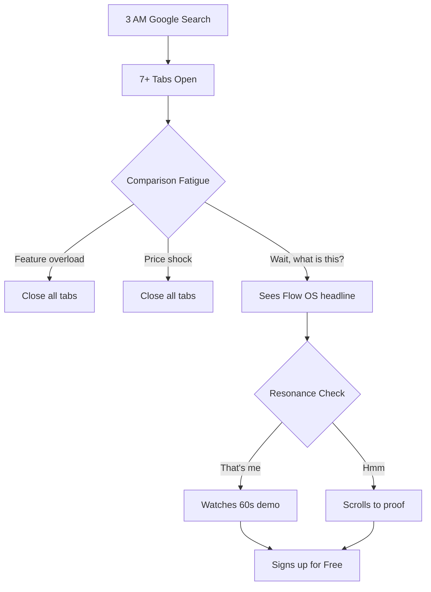

### Journey 1: Morning Inbox Triage (Daily Core Loop)

Maya opens Flow OS at 8:47 AM. She has 12 minutes before her first call. The workspace loads in her dark theme. The Inbox agent has been working overnight — 23 emails processed, 7 proposals waiting, 3 flagged.

She scans. Approves 4 with `E` key. Rejects 1 with `R`. Edits 2 inline (BlockNote). Defers 1 to discuss with client. Done in 6 minutes. The remaining minute she notices the Calendar agent caught a conflict she would have missed.

**Flood state handling:** When 147+ items arrive (after vacation, system migration), the UI shifts from individual items to batch mode. Grouped by sender, by urgency, by suggested action. The VA sees "23 from one client — accept all?" not 23 individual cards. The inbox never breaks; it adapts its density.

**Mobile triage:** Quick-approve from phone during school pickup. Full edit on desktop later. Mobile shows condensed cards with swipe gestures. Desktop shows full triage experience.

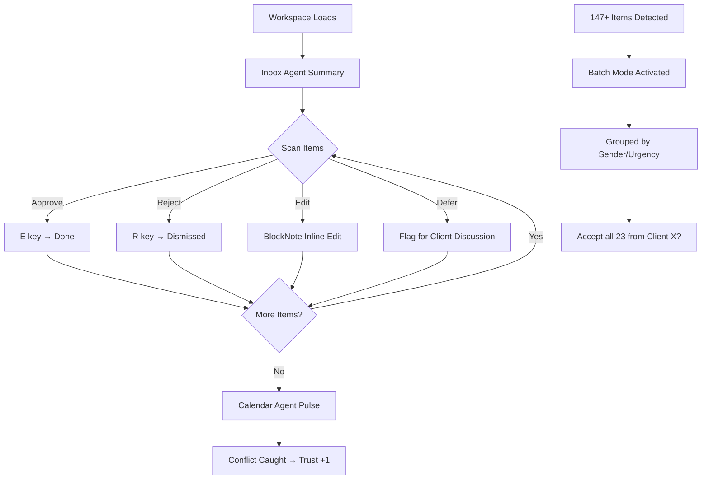

### Journey 2: First Week Onboarding (Trust Ignition)

**Day 1 — Supervised Mode:** Everything the Inbox agent suggests is visible. Maya sees the agent's reasoning. She's skeptical. She edits 8 of 10 proposals. That's expected. That's the design.

**Day 2 — First Clean Proposal:** The Inbox agent drafts a client email that Maya would have written herself. She stares at it. She approves without editing. This is the miracle moment. She physically leans forward.

**Day 3 — The Bridge:** Maya has approved 3 clean proposals in a row. The UI whispers: *"You've approved 3 without changes. Want to let Inbox handle these types of emails with confirmation?"* This is not a trust bump. This is a trust *invitation*. The Confident Beginner guardrail: the system doesn't promote her — it offers a stepping stone. She can say no. She probably says yes.

**Day 5 — First Bump:** The agent misfires. It drafts a reply that's too casual for a formal client. Maya rejects it. The UI says: *"Noted. I'll adjust for [Client Name]'s tone."* Not an apology. A promise. Trust dips but doesn't break — because the response feels like a colleague learning, not a machine failing.

**Week 1 End — Trust Score Visible:** Maya sees her first trust dashboard. Inbox agent: 3 clean proposals, 2 edits, 1 rejection. Trust trend: upward. She feels something she didn't expect: *pride in her agent.*

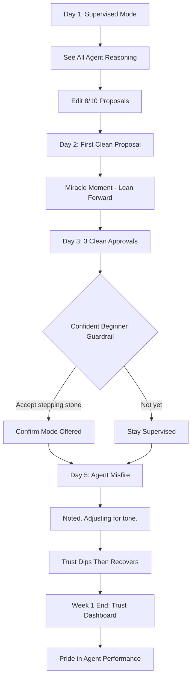

### Journey 3: Free → Pro Conversion (14-Day Window)

**PMF signal = second client in 14 days.** Maya signed up for Free. One agent. One client. Inbox is the entire product. It works so well she adds a second client on Day 10.

The moment she adds Client #2, the sidebar activates. She sees it for the first time — Calendar agent, grayed out. AR agent, grayed out. A subtle gold pulse on the Calendar icon. The tooltip says: *"Ready when you are."*

She doesn't convert on Day 10. She converts on Day 14 when she realizes she's spending 45 minutes daily on scheduling that the Calendar agent would handle in 3.

**The conversion moment is not a paywall.** It's the realization that she's doing work she no longer has to. The UI doesn't block — it reveals.

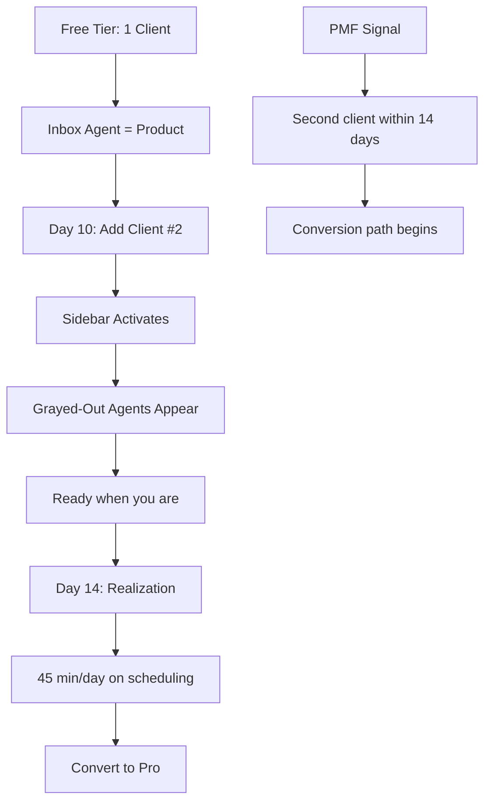

### Journey 4: Weekly Report Delivery (Client Portal)

Every Friday at 4 PM, the Weekly Report agent compiles Maya's week into a client-ready summary. The report lands in Sarah's portal — light theme, Maya's brand colors.

Sarah opens the magic-link email. She sees: *"23 tasks that left your mind."* She clicks through. The invoice shows what it bought: *"12 tasks, 4 meetings coordinated, 3 invoices sent."* She approves.

But the hidden journey is Maya reviewing the report *before* it sends. The agent drafts it at 3 PM. Maya gets a whisper notification. She reviews, edits one line, approves. The report that Sarah sees is Maya's report — polished by the agent, validated by the VA. Sarah never sees the agent. She sees Maya's excellence.

**VA emotional arc during review:** This is a vulnerable moment. The report is a mirror — it shows Maya exactly how she spent her week. If it's light ("Only 4 tasks?"), it triggers imposter syndrome. The agent must frame the report around *impact*, not activity. "4 tasks" becomes "Client A's deadline met 2 days early."

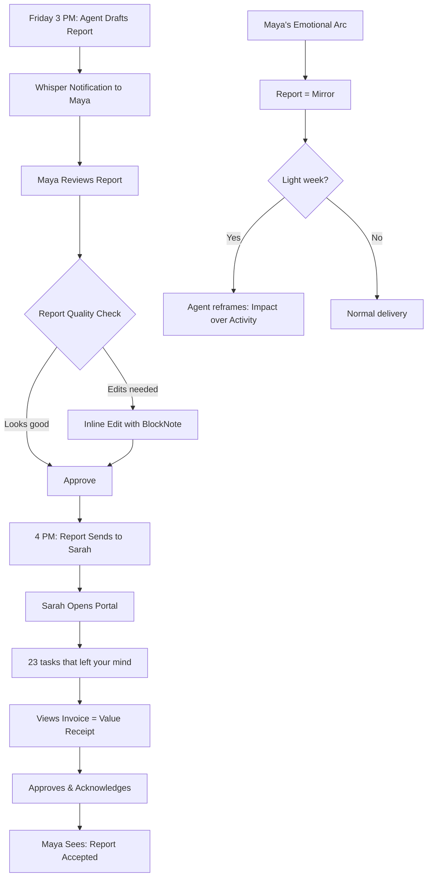

### Journey 5: Add Second Client (Trust Expansion)

Maya adds a second client. The system creates a new channel in the inbox. For a moment, the inbox count doubles — two clients, two streams. But the agents adapt immediately. The Inbox agent learned Maya's tone for Client #1; it starts fresh for Client #2, back in Supervised mode.

This is where the trust moat becomes visible. 90 days of calibration for Client #1 doesn't transfer. But Maya doesn't resent this — she understands. Each client is different. The system respects that.

The agency VA has a private excellence space — her performance with Client A is invisible to her view of Client B. Cross-client contamination of trust calibration is architecturally prevented.

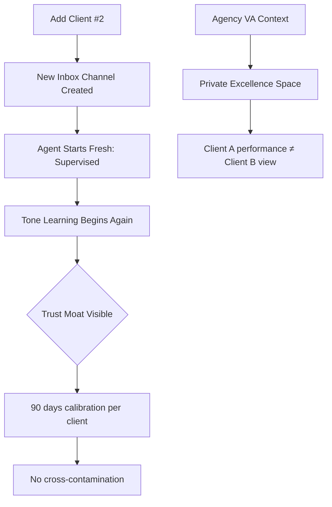

### Journey 6: Client Onboarding (New Client Setup)

Maya wins a new client. She needs to onboard them into Flow OS. She sends a magic-link invite from the workspace. The client receives it and sees the portal for the first time — Maya's branded experience.

The client sets their preferences: communication style, billing preferences, project categories. The portal guides them through a 3-step setup that takes under 2 minutes. Each step shows Maya's brand, reinforcing the relationship.

Behind the scenes, the Inbox agent enters accelerated learning mode. It watches Maya's first 5 manual emails to the new client, learning tone, formality, and patterns before making its first proposal.

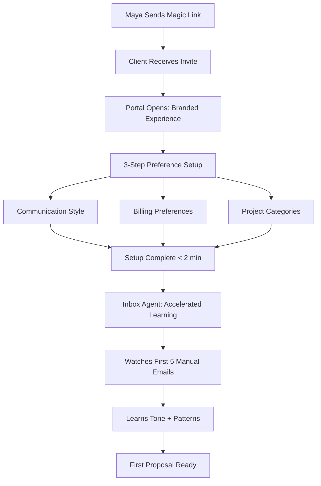

### Journey 7: Invoice Creation (Revenue Moment)

Maya needs to send an invoice. The Time Integrity agent has tracked 31.5 hours this week. The AR agent compiles time entries, matches them to client projects, and drafts an invoice.

Maya reviews the invoice in the portal preview. She sees not just hours and amounts — she sees *what those hours bought*. "12 tasks completed, 4 meetings coordinated, 3 invoices sent on your behalf." The invoice is a value receipt, not a bill.

She sends it. The client sees it in their portal. The payment link is embedded. The AR agent follows up at the configured interval if unpaid.

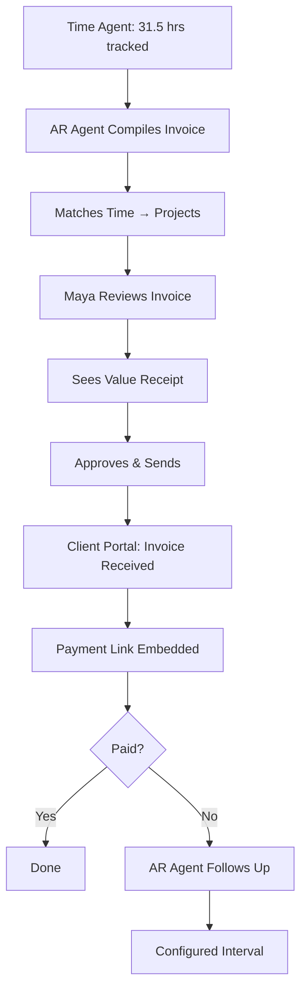

### Journey 8: Agency Owner Oversight (Agency Tier)

David opens Flow OS. He doesn't use the inbox. He uses the dashboard. He sees team-wide trust scores, agent performance across clients, and exception alerts.

His daily loop: Scan exceptions → Intervene where needed → Done. He spends 10 minutes on Flow OS, not 2 hours. His Wednesday micro-affirmation: a notification showing Elena handled 23 client emails perfectly in Confirm mode. He forwards it to Elena with "Great work." That 5-second gesture is worth more than any performance review.

**Wednesday micro-affirmation:** A designed weekly notification that highlights one team member's trust milestone. Not a dashboard metric. A story: *"Elena's Inbox agent moved to Auto for the Chen account this week. 47 emails handled without intervention."* This is management by exception, powered by affirmation.

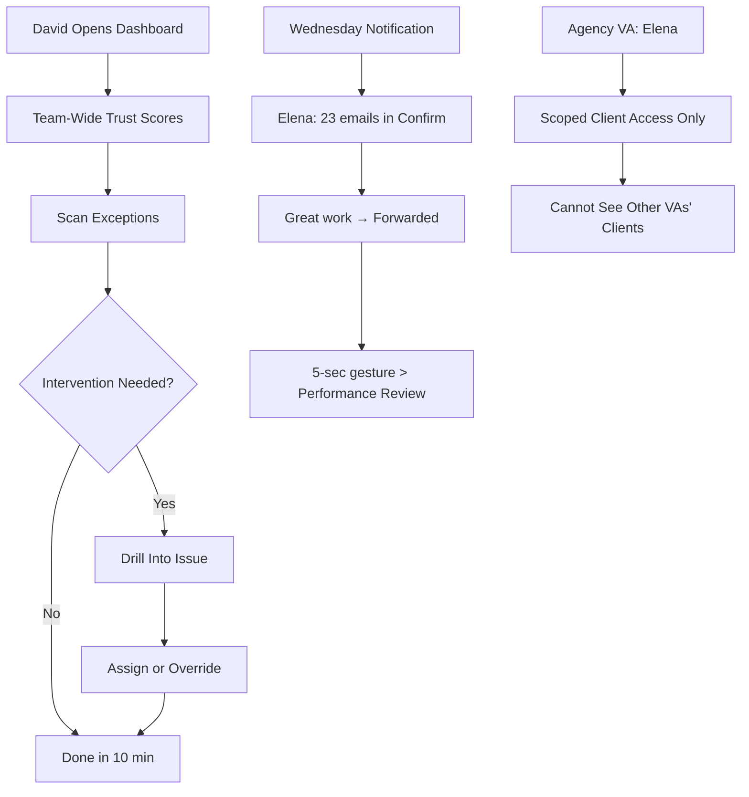

### Journey 9: Pause Journey (Stepping Away)

Maya goes on vacation. She doesn't want to think about work. She activates Pause Mode.

Agents continue running in their current trust levels but route everything to a digest. No push notifications. No whisper alerts. The workspace shows a calm banner: *"Taking a break. Your agents are holding the fort."*

When she returns, the inbox may have 200+ items. But they're batched. Grouped. Prioritized. The return experience is designed to feel like catching up with a reliable co-worker, not drowning in backlog.

**Return Journey:** The UI opens in Summary Mode first — not the full inbox. "While you were away: 47 emails handled, 12 proposals auto-approved, 3 flagged for your attention." Maya reviews the 3 flagged items and closes. 90 seconds. She's back.

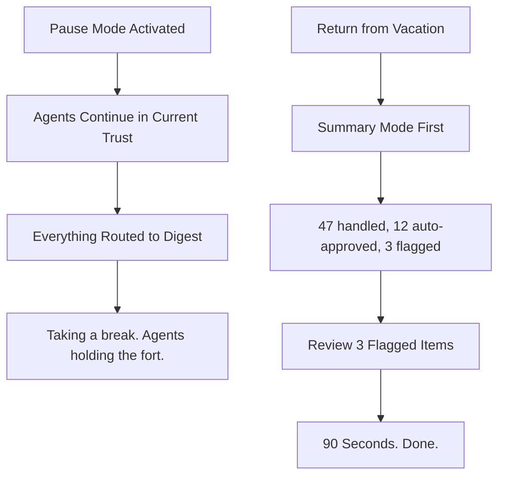

### Journey 10: Graceful Exit / Downgrade

Maya considers downgrading. Not because Flow OS failed, but because she lost a client and needs to cut costs.

The downgrade path shows her what she'd lose: *"Your Inbox agent has 90 days of calibration for 3 clients. Downgrading resets this."* Not a threat. A mirror. She sees the accumulated trust data — months of calibration visualized.

She can downgrade to Free. Keep Inbox for 1 client. The data for other clients is archived, not deleted. If she upgrades again within 30 days, calibration resumes. The exit is designed to be reversible, not punitive.

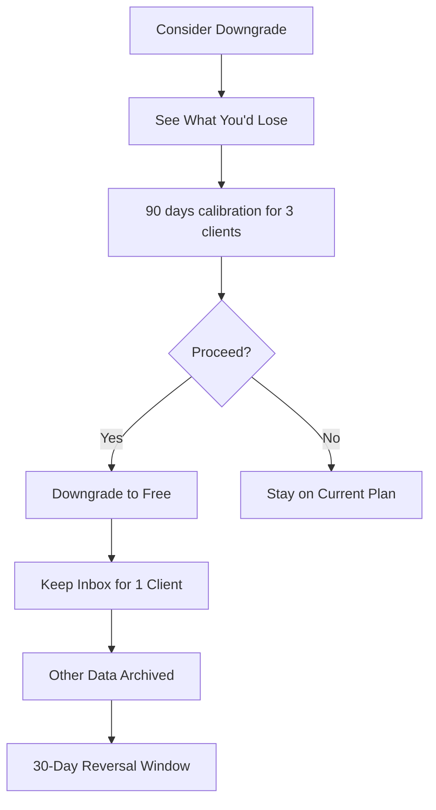

### Trust Architecture (Cross-Cutting Journey Pattern)

Trust is not a standalone journey — it is the substrate of every journey. It is embedded in the Inbox, visible in the portal, managed in the dashboard.

**Trust progression across journeys:**
- Supervised → all proposals visible, edit freely (Journeys 1, 2, 5)
- Confirm → proposals auto-send with notification, VA can override within 5 min (Journeys 1, 4, 7)
- Auto → handled quietly, gold accent divider, monthly stick-time audit (Journeys 1, 9)

Trust regression is explained, not punished. Trust promotion is offered, not forced. Trust data is the moat — non-portable, invisible, irreplaceable.

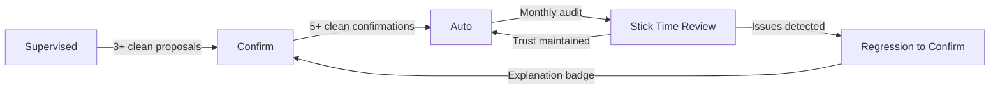

### Journey Patterns

**Navigation Pattern: Scan → Understand → Decide**
Every journey follows the same cognitive rhythm. The VA scans a summary, understands what needs attention, and decides. This pattern is consistent whether it's inbox triage, report review, or invoice approval. The UI never breaks this rhythm.

**Decision Pattern: Approve / Edit / Reject / Defer**
Four actions. Every item. Every journey. No context-switching to learn new controls. Keyboard shortcuts (`E`, `R`, inline edit, flag) are universal.

**Feedback Pattern: Whisper → Pulse → Badge**
Progressive notification density. Whisper for small wins (trust +1). Pulse for milestones (trust level change). Badge for attention needed (misfire, regression). The VA controls whether notifications escalate.

**Recovery Pattern: Explain → Learn → Resume**
Every error follows the same arc. The agent explains what happened, shows what it learned, and resumes. No guilt. No shame. The language is always collaborative: "Let's adjust" not "I made a mistake."

**Density Pattern: Calm Default → Focused Expansion**
The default state is calm — breathable spacing, minimal visual noise. Detail expands on demand (hover, keyboard, click). The VA never feels overwhelmed by the default view.

### Flow Optimization Principles

**1. Minimize Steps to Value**
Every journey's first meaningful action must happen within 3 interactions. Inbox triage: scan → approve → done. Report review: open → scan → approve. Invoice: review → send. No journey requires more than 3 steps to complete its core action.

**2. Reduce Cognitive Load at Decision Points**
Each decision point shows exactly what the VA needs to decide — nothing more. The agent's reasoning is available but collapsed. The proposed action is prominent. The VA's options are clear. No decision requires scrolling.

**3. Progressive Trust Disclosure**
Trust information is always visible but never intrusive. Badge on each item. Summary in sidebar. Detailed breakdown on demand. The VA controls how much trust data they see.

**4. Design for Return, Not Just First Use**
Every journey has a return state designed. Inbox after vacation: Summary Mode. Report after edit: remembers last edit position. Dashboard after absence: "Here's what changed." The system assumes interruption and designs for recovery.

**5. Emotional Calibration**
Each journey has a designed emotional target. Inbox triage: calm efficiency. First week: curiosity → surprise → pride. Report delivery: professional confidence. Agency oversight: control without micromanagement. The UI adjusts its tone, density, and feedback to match.

### Testing Priorities (Cross-Journey)

**Priority 1: Trust calculation + optimistic updates.** If the trust score is wrong, the entire system collapses. Unit tests must cover every trust state transition, edge case (simultaneous approve/reject), and regression trigger.

**Priority 2: Journey boundary conditions.** What happens at 0 items? 147 items? 1000 items? The UI must never break at scale. Batch mode must activate cleanly.

**Test distribution:** 60% unit (trust logic, state transitions), 25% integration (agent↔UI sync), 15% E2E (full journey from login to trust promotion).

**Flakiness landmines:** Trust transitions are async — test with proper waits. Portal brand fetch is RSC — mock Supabase calls. Keyboard shortcuts depend on focus state — test focus management.

## Component Strategy

### Design System Coverage

**Foundation (shadcn/ui — no modification):** Card, Button, Badge, Dialog, Dropdown, Accordion, Tooltip, Avatar, Tabs, Input, Select, Form, Skeleton, Separator, ScrollArea, Table, Toast, Sidebar, Calendar, Popover, Command, Sheet, ContextMenu, ResizablePanel, Sonner, HoverCard, Collapsible, Drawer, AlertDialog, Progress, Switch, Toggle

**These cover:** buttons, forms, modals, navigation, basic feedback, layout primitives. No customization needed.

### Gap Analysis

shadcn/ui covers generic UI. Flow OS needs **domain components** — things that embody trust progression, agent interaction, and the VA-client relationship. These cannot be assembled from primitives alone without becoming unmaintainable compositions.

### Monorepo Package Structure

```
packages/
  ui/      → shadcn primitives + custom components (NO trust imports)
  theme/   → BrandProvider, CSS vars, design tokens, tailwind preset
  trust/   → trust domain logic (scoring, cadence, viewport state machine)
  editor/  → BlockEditor + trust signal emission (isolated, heavy dep)
  shared/  → types, hooks, utils (no domain logic)
apps/
  web/     → Next.js app, composes everything (composition root)
```

**Key constraint:** `ui/` package must never import from `trust/`. Components receive trust state as props. The `web/` app wires trust state into UI — it is the composition root. This keeps UI testable and prevents circular dependencies.

`editor/` is isolated because BlockNote + ProseMirror are heavy dependencies that must not contaminate the shared UI package.

### Shared State Model

| State | Owner | Pattern |
|-------|-------|---------|
| Brand/Config | Server (RSC) | BrandProvider via `cache()` + context |
| Trust Viewport | Client (jotai) | Single atom family, keyed by agent |
| Cadence Tier | Client (derived) | Computed from trust viewport — NEVER independent |
| Editor State | Client (local) | BlockNote manages its own state |
| Notification Queue | Client (jotai) | Single atom with priority ordering |

**Source of truth rule:** Trust gap is React state that writes to CSS vars for styling. Never read CSS vars back into JS. One direction: React → CSS var.

### Custom Components

#### AgentCard (Compound Component)

**Purpose:** The atomic unit of the inbox. Each agent proposal is an AgentCard.

**Compound tree:** `AgentCard` contains `AgentCard.TrustBadge` and `AgentCard.Reasoning`. TrustBadge is a slot, not a sibling — every consumer gets it automatically.

**Anatomy:**
```
┌─────────────────────────────────────────┐
│ [Agent Icon + Color] Inbox Agent  [TrustBadge] │
│ ─────────────────────────────────────── │
│ Subject: Follow up with Sarah re: Q3    │
│ Preview: Hi Sarah, I wanted to check... │
│ ─────────────────────────────────────── │
│ [▶ Reasoning]  [E Approve] [R Reject]  │
└─────────────────────────────────────────┘
```

**State Machine:**
```
idle ──(focus)──→ focused
focused ──(edit)──→ editing
focused ──(approve)──→ approved
focused ──(reject)──→ rejected
focused ──(expand reasoning)──→ reasoning
reasoning ──(collapse)──→ focused
reasoning ──(approve)──→ approved
reasoning ──(reject)──→ rejected
editing ──(save)──→ focused
editing ──(cancel)──→ focused
approved ──(auto)──→ compact
rejected ──(dismiss)──→ compact
```

**States:**
- `idle` — Collapsed. Subject + preview visible.
- `focused` — Expanded. Actions visible. Reasoning collapsed.
- `editing` — BlockNote active. Full proposal editable.
- `reasoning` — Agent's reasoning expanded below content.
- `approved` — Green flash. Fades to compact.
- `rejected` — Amber flash. Optional dismiss/reason.
- `compact` — Post-decision. Minimal.
- `batched` — Inside FloodMode. Checkbox + subject only.
- `flagged` — Agent flagged for VA attention. Amber left border.
- `auto-handled` — Gold accent. "Grace noticed."

**Props (TypeScript):**
```typescript
interface AgentCardProps {
  proposalId: string
  agentId: AgentId
  agentColor: string
  trustTier: 'supervised' | 'confirm' | 'auto'
  subject: string
  preview: string
  reasoning?: string
  content: BlockNoteContent
  isFlagged?: boolean
  isAutoHandled?: boolean
  onApprove: (id: string) => void
  onReject: (id: string, reason?: string) => void
  onEdit: (id: string, content: BlockNoteContent) => void
}
```

**Accessibility:**
- `role="article"`, `aria-label="Proposal from {agent}"`
- Keyboard: `E` approve, `R` reject, `Enter` expand, `Tab` between cards
- Focus trap in editing mode
- Screen reader announces trust tier

**Error boundary:** Wrapped in component-level error boundary. Fallback: compact card with "Couldn't load full proposal" + retry.

#### AgentCard.TrustBadge

**Purpose:** Visualize agent trust level. Always rendered inside AgentCard — never standalone.

**State Machine:**
```
supervised ──(3+ clean)──→ confirming
confirming ──(VA accepts)──→ confirm
confirming ──(VA declines)──→ supervised
confirm ──(5+ clean)──→ promoting
promoting ──(VA accepts)──→ auto
promoting ──(VA declines)──→ confirm
auto ──(monthly audit)──→ stick_time
stick_time ──(maintained)──→ auto
stick_time ──(issues)──→ regressing
auto ──(misfire)──→ regressing
regressing ──(acknowledged)──→ confirm
```

**Visual tiers:**
- `supervised` — Blue pill, "Learning", 1px solid border
- `confirm` — Violet pill, "Established", 1px dashed border
- `auto` — Green pill, "Auto", no border
- `promoting` — Ceremony animation. Scale 1.0→1.2→1.0. 500ms.
- `regressing` — Amber badge. "Something changed. Let's pay attention together." Auto-dismiss 5s.
- `stick_time` — "Ready for review?" Accept/defer CTAs.

**Variants:**
- `inline` — Inside AgentCard. 16px height.
- `sidebar` — In AgentStatusBar. Dot indicator only. 8px.

**Animation config:** `animationDuration: 0` in test mode. `prefers-reduced-motion: transition-none`.

#### TrustRecovery

**Purpose:** The most important moment in the system — when trust breaks. When an agent misfires in Auto mode, Maya doesn't need a badge. She needs a moment. This component is that moment.

**Anatomy:**
```
┌─────────────────────────────────────────┐
│ ⚠️ Something needs your attention        │
│                                          │
│ Inbox Agent drafted a casual reply to    │
│ a formal client. Here's what happened:  │
│                                          │
│ [What the agent was thinking]            │
│ "Sarah's previous emails used first     │
│  name, so I matched that tone."         │
│                                          │
│ [What to do]                            │
│ ○ Keep in Auto — this was a one-off     │
│ ○ Move to Confirm for this client       │
│ ○ Move to Confirm for all clients       │
│                                          │
│ [Apply]                                 │
└─────────────────────────────────────────┘
```

**Key principle:** Never shame the agent. Never shame the VA. The language is always collaborative: "Something needs your attention" — not "The agent made a mistake." Maya keeps control. She decides the severity.

**States:**
- `presented` — Failure shown with context.
- `deciding` — VA choosing response action.
- `applied` — Action taken. Brief confirmation. Auto-dismiss.

#### TriageInbox (Route-Level Composition)

**Purpose:** The viewport that replaces Maya's email client. Not a component — a route-level composition that orchestrates AgentCards, filtering, sorting, trust thresholds, and real-time updates.

**State Machine:**
```
empty ──(items arrive)──→ individual
individual ──(count ≥ 147)──→ flood
flood ──(count < 50)──→ individual
individual ──(user returns from absence)──→ summary
summary ──(user dismisses)──→ individual
summary ──(user reviews flagged)──→ individual
flood ──(user returns from absence)──→ summary
```

**Modes:**
- `individual` — One AgentCard per item. Keyboard navigable.
- `flood` — FloodMode activated. Batch handling.
- `summary` — Return-from-absence. Aggregate first, individual on demand.
- `empty` — "All clear." Calm illustration.

**Interaction:**
- Arrow keys navigate cards
- `E`/`R` on focused card
- `Shift+E` approve all visible
- Filter: by agent, by client, by trust tier
- Sort: by urgency, by time, by agent

**Empty states:**
- `zero-data` — New user. GuidedFlow shows one agent at a time.
- `all-clear` — Inbox cleared. Celebration micro-moment.

**Tech:** Virtual scrolling required for 1000+ items (`react-window` or similar). Keyboard focus management across virtual items. Error boundary with full-page fallback.

#### AgentStatusBar

**Purpose:** Persistent sidebar showing all active agents with health at a glance. Uses `AgentCard.Status` slot pattern.

**Cadence tiers:**
- High-cadence (Inbox, Calendar): Always expanded, full height.
- Low-cadence (AR, Report, Health): Collapsed accordion, expand on hover/click.
- Ambient (Time): Icon only in footer.

**States:** `active` (pending items + count badge), `idle` (subtle pulse), `error` (red overlay), `learning` (blue dot, new client), `paused` (dimmed).

**Accessibility:** Each agent is `role="button"` with `aria-expanded`. Arrow keys navigate. `aria-label="{agent}: {status}, {count} items"`.

#### BlockEditor

**Purpose:** Inline proposal editor. BlockNote wrapped with agent diff and approval controls.

**Package:** Isolated in `packages/editor/` due to heavy BlockNote/ProseMirror dependencies.

**States:** `viewing` (read-only + diff), `editing` (BlockNote active), `diff` (changes highlighted), `saved` (awaiting approval).

**Critical specs:**
- Conflict resolution: Supabase real-time → last-write-wins with VA override
- Offline queue: localStorage buffer, sync on reconnect
- Cursor presence: Not in Phase 1. Phase 2+.

**Accessibility:** BlockNote inherits contenteditable. Diff announced: "Agent changed: {summary}". `Escape` exits editing, `Cmd+Enter` saves.

**Error boundary:** Per-editor boundary. Fallback: read-only view + "Couldn't load editor" + retry.

#### GuidedFlow + ZeroState

**Purpose:** Onboarding component that introduces one agent at a time. Prevents the "six agents on day one" overwhelm.

**Flow:** Inbox agent only → first approval → "Calendar agent is ready" → Calendar appears → etc.

**ZeroState pattern:** Every component has an empty state designed:
- TrustDashboard: "Your agents are learning. Come back in a few days."
- TriageInbox: "All clear. Enjoy the quiet."
- PortalHero: "Your first report arrives Friday."

#### NotificationTier (Unified Component)

**Purpose:** Single component with three variants replacing three separate notification components.

**Variants:**
- `whisper` — Bottom-right. No sound. Auto-dismiss 4s. For trust +1, agent learning.
- `pulse` — Bottom-right. Optional sound. Auto-dismiss 8s. For trust level changes, client actions.
- `ceremony` — Center overlay. Blocking. Cannot dismiss without decision. For trust promotion.

**Props:**
```typescript
interface NotificationTierProps {
  variant: 'whisper' | 'pulse' | 'ceremony'
  title: string
  body?: string
  action?: { label: string; onAction: () => void }
  dismissible?: boolean
  animationDuration?: number
}
```

**Stacking:** Max 3 whispers visible. Max 1 pulse. Max 1 ceremony (blocking). Queue overflow = auto-dismiss oldest whisper.

**Z-index:** whisper: 40, pulse: 50, ceremony: 60.

**Test config:** `animationDuration: 0`. No test ever waits for animation.

#### FloodMode (Cross-Cutting Concern)

**Purpose:** Batch handling for 147+ items. Not just a display component — a system-wide state override.

**State Machine:**
```
individual ──(count ≥ 147)──→ flood_activated
flood_activated ──(count < 50)──→ individual
flood_activated ──(user manual override)──→ individual
```

**PrioritySignal:** Embedded within FloodMode. Surfaces the 5 items that actually need attention. Not "here are 200 items" — "here are 5 that matter, the rest are routine."

**Concurrent state handling:** FloodMode preempts TrustCeremony. If flood activates mid-ceremony, ceremony queues and resumes when flood resolves. Explicit collision contract.

#### SummaryMode

**Purpose:** Return-from-absence catch-up in 90 seconds.

**Data contract:** Accepts `{ handled: number, autoApproved: number, flagged: AgentCard[] }`.

#### TrustDashboard

**Purpose:** Trust visualization. Two views: solo VA grid, agency owner heatmap.

**Solo VA:** Agent cards with trust bars, trend sparkline, next audit date.

**Agency Owner (TeamTrustOverview):** Team-wide heatmap. VA × Agent matrix with trust dots. Exception count. Wednesday micro-affirmation highlight.

**States:** `overview`, `detail` (single agent history), `audit` (monthly stick-time), `empty` (new user).

#### PortalHero

**Purpose:** Client portal "wow" metric. Zero-Thought Tasks.

**States:** `counting` (animated count-up 0→N in 1.2s), `static`, `trending` (4-week sparkline), `empty` ("Your first report arrives Friday").

**Stillness:** When nothing changed since yesterday, PortalHero shows: *"Everything's on track. Next update Friday."* Calm is the message.

#### BrandProvider

**Purpose:** Runtime theme injection. RSC fetches VA brand from Supabase → injects 8-12 CSS vars.

**Architecture:** `layout.tsx (RSC) → fetchBrand(vaId) → cache() → inject CSS vars → children`

**Variables:** `--brand-primary`, `--brand-secondary`, `--brand-accent`, `--brand-font-heading`, `--brand-font-body`, `--brand-radius`, `--brand-logo`

**Fallback:** "The Minimalist" preset if no customization.

#### ValueReceipt

**Purpose:** Invoice as value. Client portal only. Shows what hours bought.

**Note:** Needs user validation before build. Ship as one-off in Phase 3, promote to component only if validated.

#### MagicLinkAuth

**Purpose:** Passwordless client auth. Click magic link → branded portal.

**Flow:** First-time → 3-step preferences. Returning → instant access. Expired → graceful re-send.

### Component Implementation Strategy

**Foundation (shadcn/ui):** Used as-is.

**Extended (shadcn base + wrapper):**
- `AgentCard` extends Card (compound)
- `NotificationTier` extends Sonner (variants)
- `AgentStatusBar` extends Sidebar primitives
- `FloodMode` extends Accordion pattern

**Custom (built from scratch):**
- `BrandProvider` — RSC context
- `TrustRecovery` — custom modal flow
- `GuidedFlow` + `ZeroState` — custom onboarding
- `PortalHero` — custom animated metric
- `SummaryMode` — custom aggregate view
- `ValueReceipt` — custom portal component

### State Machine Specifications (Pre-Build Requirement)

Before any component with >3 states enters development, it must have a documented transition table: `{ state → event → nextState }`. These are test oracles.

**Components requiring state machines:**
1. AgentCard — 10 states
2. AgentCard.TrustBadge — 10 states
3. TriageInbox — 4 modes
4. FloodMode — 3 states
5. TrustRecovery — 3 states
6. NotificationTier ceremony variant — 3 states

### Test Architecture

**Distribution: 70% unit / 25% integration / 5% E2E**

**Per-component split:**
- TriageInbox: 80% unit (scroll, modes, keyboard), 15% integration, 5% E2E
- FloodMode: 90% unit (threshold logic), 10% integration
- NotificationTier ceremony variant: 60% unit (state machine), 30% integration, 10% E2E
- AgentCard: 70% unit (each state), 30% integration (compound composition)

**Testing patterns established early:**
- State machine test harness: derive tests from transition tables
- Shared atom test fixture: controlled jotai environment for every test
- Compound component isolation: unit test each slot, contract test the composition
- Animation kill config: `animationDuration: 0` global test wrapper

**Flakiness mitigations:**
1. TriageInbox virtual scroll — test logic, not DOM position
2. NotificationTier animations — configurable duration
3. FloodMode threshold — test pure function, not React render
4. Trust viewport CSS var — test atom output directly

### Implementation Roadmap

**Phase 0 — Spec Sprint (3 days, before any build):**
- TypeScript interfaces for all components
- State machine transition tables for all >3 state components
- Error boundary assignments per component
- Storybook story requirements
- Unit test acceptance criteria per component

**Phase 1 — Core (Week 1-2):**
- BrandProvider + theme package
- MagicLinkAuth
- BlockEditor (data layer first, UI second)
- AgentCard (compound, including TrustBadge slot)
- AgentStatusBar (high-cadence only)
- NotificationTier (whisper variant only)
- GuidedFlow + ZeroState (onboarding)

**Phase 2 — Expansion (Week 3-4):**
- TriageInbox (route composition, individual mode)
- NotificationTier (pulse + ceremony variants)
- TrustRecovery
- TrustDashboard (solo VA)
- PortalHero
- SummaryMode

**Phase 3 — Scale (Week 5-6):**
- FloodMode (with PrioritySignal)
- TrustDashboard (agency TeamTrustOverview)
- ValueReceipt (one-off, validate before promoting)
- Full keyboard navigation matrix
- Agency-scoped error boundaries

## UX Consistency Patterns

### Button Hierarchy

**Four tiers. No more.**

| Tier | Use | Visual | shadcn Component | Gold Accent? |
|------|-----|--------|-------------------|-------------|
| **Primary** | Main CTA per view | Filled, `hsl(var(--primary))` | `<Button variant="default">` | Yes — gold `#D4A574` |
| **Secondary** | Alternative actions | Outlined, `hsl(var(--border))` | `<Button variant="outline">` | No |
| **Ghost** | Tertiary, toolbar | Transparent, text only | `<Button variant="ghost">` | No |
| **Destructive** | Delete, reject, regress | Red text/outline | `<Button variant="destructive">` | No |

**Rules:**
- One primary CTA per view. Exception: **Decision pairs** (Approve + Reject) are a single decision unit. Approve = Primary. Reject = Destructive. Both visible, one choice.
- Keyboard shortcuts (`E`, `R`) bypass buttons but produce the same effect.
- Ghost buttons never appear alone.
- Labels: verb + object ("Approve proposal"). Never just "OK".
- Loading state: `disabled` + spinner. Text changes to gerund ("Approving...").
- Portal: VA's brand primary replaces gold.

**Mobile:** Primary buttons stretch full-width below `640px`. Secondary and ghost remain inline.

**Implementation:** Extend `buttonVariants` via `cn()` wrapper in a separate file. Never modify shadcn-generated `components/ui/button.tsx` directly — CLI updates clobber customizations.

### Feedback Patterns

**Five tiers, modeled as a state machine:**

```
whisper ──(escalate)──→ pulse
pulse ──(escalate)──→ ceremony
pulse ──(resolve)──→ dismissed
ceremony ──(user action)──→ resolved
TrustRecovery ──(user action)──→ resolved

Illegal transitions:
ceremony → whisper ✗
whisper → TrustRecovery ✗ (must go through pulse first)
```

**Notification facade architecture:** Whisper, pulse, and ceremony are three separate rendering models behind a `NotificationFacade`. Not one god component — three focused components with shared dispatch logic.

| Situation | Pattern | Duration | Dismissal | Tone |
|-----------|---------|----------|-----------|------|
| Trust +1 | Whisper | 4s auto | Auto | Quiet pride |
| Trust level change | Pulse | 8s auto | Manual | Milestone |
| Trust promotion invite | Ceremony | Until decision | Cannot dismiss | Ceremony |
| Agent error / recovery | TrustRecovery | Until action | Cannot dismiss | Collaborative |
| Form validation | Inline field error | Until fixed | Auto on fix | Neutral guidance |

**Success feedback:**
- Approve: Green flash (150ms), card → compact. Whisper: "Inbox handled this."
- Bulk approve: Counter increments. Single whisper: "12 items handled."
- Save: Toast, bottom-right, 3s.

**Error feedback:**
- Network error: Inline banner at top of viewport. "Something went wrong." + Retry.
- Validation error: Red text below field. Focus moves to first error.
- Agent misfire: TrustRecovery component. Always a moment, never a toast.

**Loading feedback:**
- Initial load: Skeleton matching layout shape. No spinners for page loads.
- Agent thinking: Skeleton card with agent icon + "Thinking..." after 2s.
- Dashboard data: Skeleton grid. Data fades in.

**Progress feedback:**
- Trust progression: Trust bar fills. Sparkline updates. Never a percentage.
- Bulk operations: "Processing 12 of 147..." with progress bar. Cancellable.

**VA agency reaffirmation:** Every agent success subtly reinforces VA ownership. Whisper copy uses "Your instructions. Your standards." not "Agent completed."

### Form Patterns

**Principles:**
- One-column layout. Always.
- Labels above inputs. Never placeholder-only.
- Required fields: mark optional fields with "(optional)". No asterisks.
- Smart defaults for everything the system can infer.

**Validation:**
- Inline, on blur. Not on submit.
- Error message = specific guidance.
- shadcn `<Form>` with zod. Schema generated from Supabase column types to prevent drift.

### Navigation Patterns

**Workspace (dark theme):**
- **Primary:** shadcn `<Sidebar>`. Agent-centric.
- **Route structure:** `/inbox`, `/calendar`, `/ar`, `/reports`, `/health`, `/time`, `/settings`
- **Active state:** Left border in agent's permanent color.
- **Mobile (<640px):** Bottom tab bar. Inbox + Calendar visible. Others under "More".
- **Breadcrumbs:** Only in settings.

**`lg` breakpoint (1024-1279px):** Collapsed icon sidebar. Agent icons + status dots. Expand on hover or `]` key. Full sidebar on expand toggle.

**Agency navigation — Context Switcher:**
Dropdown at top of sidebar: `Elena ▾` → scopes workspace to Elena's clients/agents. "All VAs" → overview mode. People-first for David, agents remain underneath.

**Portal (light theme):**
- Top tab bar. `Invoices · Projects · Upcoming · Message`. One level deep max.
- Magic link = deep link.

**Keyboard navigation:**
- `1-6`: Jump to agent. **Guarded:** disabled when input/search is focused.
- `/` or `Cmd+K`: Command palette.
- `?`: Shortcut overlay.
- `Escape`: Close overlay, return to context.
- Arrow keys: Navigate within lists/cards.

**Keyboard flow hierarchy:** Primary action receives focus first in a card. Tab order: content → actions → next card.

### Overlay Management

**OverlayPriority enum — serialized through single manager:**

| Priority | Type | Component | Dismissible? |
|----------|------|-----------|-------------|
| 60 | Ceremony | NotificationTier.ceremony | No |
| 50 | Recovery | TrustRecovery | No |
| 40 | Alert | AlertDialog | Yes (cancel) |
| 30 | Form dialog | Dialog | Yes (X) |
| 20 | Command | Command | Yes (Escape) |

**Rules:**
- Max one overlay active. Others queue by priority.
- Focus trap on active overlay. Focus returns to trigger on dismiss.
- Trust events queue behind current overlay.
- No stacked modals. Ever.

**Ceremony rules:**
- Blocking. `Escape` does nothing. `Enter` accepts.
- On mobile: trust state changes immediately. Celebration deferred to next desktop login. Trust decision never deferred.

**Deferred ceremony:** Badge the milestone. Gold pulse on TrustBadge. Next desktop login: ceremony surfaces first.

### Empty State Patterns

**Three elements:** Calm icon + one sentence + one action (or reassurance).

| Context | Empty State |
|---------|-------------|
| Inbox (0 items) | "All clear. Your agents are watching." + Agent status |
| Trust (new user) | "Your agents are learning." + GuidedFlow |
| Reports (no data) | "Your first report arrives Friday." + Countdown |
| Portal (first visit) | "Welcome." + 3-step onboarding |
| FloodMode (resolved) | "All caught up." + Summary |

**Threshold moment — first login:** Not an empty state — a sacred threshold. GuidedFlow introduces Inbox only. Workspace is deliberately sparse. Everything unlocks progressively.

**Stillness:** Nothing changed = calm. "Everything's on track. Next update Friday."

**Skeleton → content:** Minimum skeleton display: 300ms. Prevents flash race condition.

### Trust-Specific Interaction Patterns

**Trust promotion ceremony:**
1. Badge pulse (500ms) → Whisper → VA clicks → Ceremony (priority 60)
2. Shows current tier, what changes, "Accept?" / "Not yet"
3. Accept → badge transitions, micro-celebration (300ms)
4. Decline → closes. Next invite in 3 days.

**Trust regression — TrustRecovery:**
1. Regression badge → Whisper → VA clicks → TrustRecovery (priority 50)
2. Shows what happened, agent reasoning, options
3. **Owner intervention (David):** Can pause VA's auto-mode. Leave a note. Action, not just visibility.

**Monthly stick-time audit:** 30 days in Auto → Pulse → re-densify → review 5-10 items → confirm or recover.

**"Oh Crap" Cascade — Undo/Intercept:** Persistent "Sent 2 min ago — Intercept" affordance on recently approved items. Configurable window (5 min Confirm, 15 min Auto). Pull thread → TrustRecovery + client notification composed by VA.

**Comparison Moment:** TrustDashboard shows: "47 proposals handled. Your estimated manual time: 4.2 hours. Agent time: 12 minutes." Identity affirmation: "You amplified your reach by 21x."

**Ambient trust texture:** Sidebar agent icons warm subtly as trust deepens (saturation shift). VA feels the relationship without checking a score.

### Client-Facing Patterns

**"Agent working" portal state:** Status line: "Your request is with [VA Name]. Typically resolved within 2 hours." No AI exposed.

**Client handoff staging area:** VA reviews report/invoice in portal-themed staging view before sending. "Here's what Sarah will see." Dedicated pattern, not a modal.

**Portal dark mode:** Respects `prefers-color-scheme`. Light default, dark available. Brand tokens tested for contrast in both modes.

### Responsive Patterns

| Breakpoint | Width | Layout |
|-----------|-------|--------|
| Mobile | < 640px | Bottom tabs, drawer, stacked cards, swipe |
| Tablet | 640-1024px | Collapsible sidebar, side sheet |
| Laptop (`lg`) | 1024-1279px | Icon sidebar, expand on hover/`]`, 360px pane |
| Desktop | 1280-1440px | Full sidebar, inline detail pane |
| Wide | > 1440px | Full sidebar, detail + optional second pane |

**Mobile:** AgentCard condensed (swipe only). Keyboard shortcuts disabled. Swipe threshold: 80px, direction-locked. Ceremony deferred, trust state immediate.

**Tablet + keyboard:** Both input modes active. Keyboard priority when physical keyboard detected.

### Motion and Transition Patterns

**Timing:** Micro 150ms, Standard 300ms, Emphasis 500ms-1.2s.

**Easing:** `cubic-bezier(0.4, 0, 0.2, 1)`. One curve.

**Reduced motion:** `prefers-reduced-motion: reduce` → all transitions `0ms`. Opacity fades only. Count-ups show final number.

**Stagger:** Cards enter with 50ms stagger. Exit: fade + shrink 200ms.

**Illustration loading:** Lazy-loaded. Skeleton icon meets 150ms budget. Illustration fades in when ready.

### Accessibility Patterns

**Keyboard-first:** Every element reachable. Focus ring visible. Focus returns to trigger. Focus trap in modals. Shortcut guard when inputs focused.

**Screen reader:** `role="article"` for proposals. `aria-live="polite"` for trust changes. `role="alertdialog"` for ceremony.

**Color:** Never color-only. TrustBadge has text + color. Both themes WCAG AA. Portal dark mode tokens tested.

**Touch targets:** 44px × 44px minimum on mobile.

### RSC/Client Boundary Strategy

| Layer | Rendering | State | Examples |
|-------|-----------|-------|---------|
| Layout shell | RSC | None | Sidebar structure, page frames |
| Data hydration | RSC → Client | jotai init | BrandProvider, initial trust scores |
| Interactive | Client | jotai atoms | AgentCard, TrustBadge, notifications |
| Real-time | Client | Supabase subscriptions | Trust updates, inbox count |

**BrandProvider hydration:** `providers/BrandHydrator.tsx` — RSC fetches → serializes → client provider initializes atom. Defined boundary.

**AgentCard boundary:** Shell (subject, preview) can be RSC. TrustBadge + actions = `"use client"`. Atom selector + `React.memo` prevents re-render thrash.

### Test Architecture for Patterns

**Composition contract tests** at seams — every overlay type against every other for priority resolution.

**Motion-agnostic assertions:** Test outcomes, not durations.

**Reduced motion twins:** Every animation test has a `prefers-reduced-motion` counterpart.

**Keyboard shortcut isolation:** Guard tests confirm shortcuts don't fire during input focus.

**Overlay priority test:** TrustRecovery queues behind AlertDialog correctly.

## Responsive Design & Accessibility

### Accessibility User Personas

**Before defining compliance levels, we name the people we're building for:**

**Priya** — Legally blind VA. Uses JAWS on Windows. Navigates everything by keyboard + screen reader. Her JAWS intercepts `/` as its own quick-search key. She needs a spatial model of the workspace, not 47 tab stops. She needs trust progression felt through interaction quality and consistency, not just badge colors.

**Marcus** — ADHD VA in a co-working space. Frequent interruptions break flow. Progressive disclosure creates *amnesia by interface* — every return requires rebuilding mental model. Needs persistent context markers and "where you left off" indicators.

**Lin** — VA with motor tremors. `E` and `R` are adjacent keys. One tremor = one rejected deliverable with no undo. Needs confirmation on destructive actions and larger interaction zones.

**These three humans are our accessibility north star. WCAG 2.1 AA is the floor. Their daily experience is the ceiling.**

### Responsive Strategy

**Desktop-first with mobile companion.** VAs spend 6-8 hours at desk. Desktop = full power. Mobile = quick triage, approvals, status checks.

**Two strategies:**
- **Workspace (dark):** Desktop = primary. Mobile = companion (swipe, condensed, no editing, ceremony deferred).
- **Portal (light/dark):** Responsive across all devices. Content parity, adapted density.

### Breakpoint Strategy

| Breakpoint | Width | Workspace | Portal |
|-----------|-------|-----------|--------|
| **Mobile** | < 640px | Bottom tabs, stacked, swipe | Single column, bottom CTAs in thumb zone |
| **Tablet** | 640-1024px | Collapsible sidebar, side sheet | Two-column where space allows |
| **Laptop** | 1024-1279px | Icon sidebar, expand on hover/`]` | Full layout, condensed |
| **Desktop** | 1280-1440px | Full sidebar, inline detail pane | Full layout |
| **Wide** | > 1440px | Full sidebar, dual pane | Generous whitespace |

**Container queries** for component-level adaptation. 90%+ browser support. Viewport breakpoints for page layout, container queries for components.

**Viewport orchestration:** When VA resizes to split-screen, page-level orchestrator collapses panels into priority stack. Not just component reflow — composition management.

**Mobile interaction zones:** Primary CTAs in thumb-reach zone (bottom 60%). Destructive actions outside easy reach. Approve = bottom. Reject = top-right of card (reachable but intentional).

**Orientation handling:** iPad Pro landscape (1194px) = laptop breakpoint. Portrait (834px) = tablet. Document orientation shift explicitly.

### Accessibility Compliance

**WCAG 2.1 Level AA** as floor. WCAG 2.2 best practices where feasible.

#### Color and Contrast

| Element | Foreground | Background | Ratio | Level |
|---------|-----------|------------|-------|-------|
| Workspace body | `#E4E4E7` | `#0E0E10` | 15.2:1 | AAA |
| Workspace muted | `#A1A1AA` | `#0E0E10` | 7.8:1 | AAA |
| Gold accent | `#D4A574` | `#0E0E10` | 4.6:1 | AA |
| Portal body (light) | `#18181B` | `#FAFAFA` | 18.1:1 | AAA |
| Portal body (dark) | `#E4E4E7` | `#18181B` | 15.2:1 | AAA |
| TrustBadge blue/violet/green | varies | `#0E0E10` | 7.2-9.4:1 | AAA |
| Destructive red | `#FCA5A5` | `#0E0E10` | 6.8:1 | AAA |

**Brand tokens:** Validated at save time AND build time (CI). Auto-adjust shade if AA fails.

**Three-channel status:** Every indicator in at least two channels (color + icon, color + label, color + border style). Never color alone.

**Colour-blindness simulation:** Protanopia, deuteranopia, tritanopia tested per major release.

#### Keyboard Navigation

**Full operability. Shortcuts remappable.**

| Default | Action | Guard |
|---------|--------|-------|
| `1`-`6` | Navigate to agent | Disabled when input focused |
| `/` | Command palette | **Remappable** (JAWS conflict) |
| `E` | Approve | 3s undo window |
| `R` | Reject | 3s undo window |
| `Shift+E` | Approve all visible | Inbox focused |
| `Escape` | Close overlay | Context-dependent |
| `]` / `[` | Expand/collapse sidebar | Always |

**Keyboard remapping:** Settings → Keyboard. Priya remaps `/` to `Ctrl+K`. Lin remaps reject away from approve. Essential, not optional.

**Undo guardrail:** After keyboard reject, 3-second undo toast. Configurable in settings.

**Focus management:** Shared `useFocusTrap` hook. Focus returns to trigger on overlay close. Skip link at page top.

**Screen reader spatial model:** `aria-roledescription="workspace"`. Announces: "Workspace: 3 agent panels, Inbox active."

#### Screen Reader Support

**Semantic HTML + ARIA per component** (full table in patterns section). Key rules:
- `aria-live="polite"` for inbox count, trust +1, agent learning
- `aria-live="assertive"` for ceremony invitations, trust regressions only
- Never `assertive` for non-critical updates
- Form errors: `aria-describedby` linked to fields, announced on invalid

#### Touch and Gesture

- 44px × 44px minimum touch targets
- Swipe: 80px threshold, direction-locked after 10px
- All gestures have button equivalents
- Pinch-to-zoom never disabled
- No time-limited interactions

#### Cognitive Accessibility

- 8th-grade reading level for all UI copy
- **Distraction recovery:** "Where you left off" indicator persists across interruptions. "You were reviewing Inbox, 3 items remaining."
- **Progressive disclosure calibrated** to demonstrated competency
- **Consistent actions:** Approve/Edit/Reject/Defer everywhere
- **No auto-advancing content.** Updates via live regions, not layout jumps

#### Zoom and Scaling

- Survives 200% zoom without horizontal overflow
- Survives 400% zoom with single-column reflow
- Tested per major release

### RSC + Accessibility Boundary

**Server Components:** Semantic HTML, static ARIA, heading hierarchy, alt text, skip links, contrast (CSS).

**Client Components:** Focus management, dynamic ARIA, live regions, keyboard nav, motion preference, post-async announcements.

**Pattern:** `AccessibleOverlay` client wrapper around server-rendered content. Handles focus trap, escape, aria. Content stays server-rendered.

### Implementation Guidelines

**CSS:** Tailwind for viewport breakpoints. Container queries for components. `clamp()` typography as design tokens (no arbitrary values). Relative units for spacing.

**Assets:** SVG icons only (Lucide, individual imports). No bitmap UI elements.

**Bundle:** Tailwind 8-15KB, shadcn 12-18KB, jotai ~2KB. Risk = client hydration count. `@next/bundle-analyzer` from sprint 1.

**shadcn composition:** Every custom composition gets a11y review. Customization breaks base library a11y.

**Focus:** Shared `useFocusTrap` hook. No one-off overlays.

**Theme:** Every token has dark variant. Contrast check in CI build.

### Testing Strategy

#### Automated (Every PR)

| Test | Tool | Catches |
|------|------|---------|
| a11y hygiene | axe-core via Playwright | ~30-40% of issues |
| Keyboard reachability | Playwright `keyboard.press('Tab')` | Focus order, traps, indicators |
| Focus management | Playwright assertions | Modal trap, return-to-trigger |
| Lighthouse CI | Lighthouse | Easy-to-detect issues (conversation starter, not quality gate) |
| Contrast at build | Custom CI step | Token failures |
| Reduced motion | Playwright toggle | Animation bypass |

**axe-core catches 30-40%. It is a hygiene gate, not a quality gate. Lighthouse 90+ ≠ usable screen reader experience.**

#### Per New Component

shadcn composition a11y review. Component a11y matrix (keyboard, SR, contrast, motion, touch, zoom). Responsive at 5 breakpoints. Zoom at 200%/400%.

#### Per Sprint (Manual)

Screen reader on critical journeys (VoiceOver + NVDA, top 3-5 flows). Keyboard-only full journey. Colour-blindness simulation.

#### Per Release (Manual)

Full a11y audit on key pages. Colour Contrast Analyser. Zoom testing. Touch target sizing.

#### User Testing with Disabled VAs

Recruit at least 3 VAs with specific disabilities for beta. Priya (screen reader), Marcus (ADHD), Lin (motor) as reference profiles. Quarterly moderated sessions.

### Accessibility Test Matrix (Per Component)

| Component | Keyboard | SR | Contrast | Motion | Touch | Zoom |
|-----------|----------|-----|----------|--------|-------|------|
| AgentCard | ✅ | ✅ | ✅ | ✅ | ✅ | ✅ |
| TrustBadge | ✅ | ✅ | ✅ | ✅ | — | ✅ |
| NotificationTier | ✅ | ✅ | ✅ | ✅ | ✅ | ✅ |
| TrustCeremony | ✅ | ✅ | ✅ | ✅ | — | ✅ |
| TrustRecovery | ✅ | ✅ | ✅ | — | — | ✅ |
| TriageInbox | ✅ | ✅ | ✅ | — | ✅ | ✅ |
| Command palette | ✅ | ✅ | ✅ | — | — | ✅ |
| Forms | ✅ | ✅ | ✅ | — | ✅ | ✅ |
